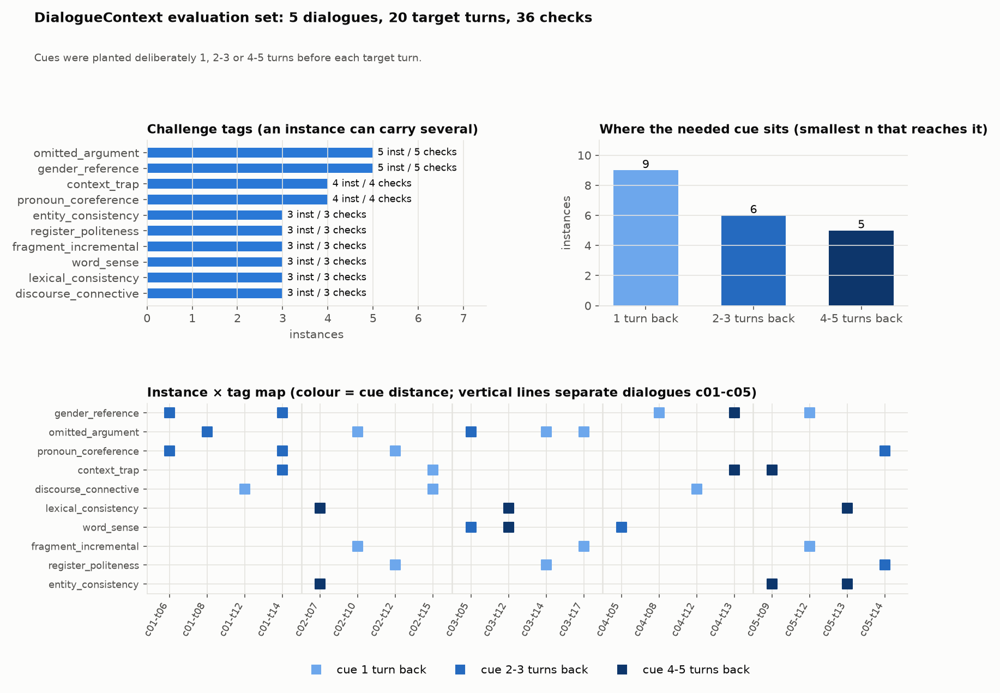

# DialogueContext — 대화 문맥의 형태·길이가 번역 품질과 지연에 주는 영향 (ko→en)

실행 `dctx-20260925` · 2026-09-25 실행, 2026-09-26 정리 · 코드와 데이터는 `evaluation/DialogueContext/`

## 요약

- **문맥은 도움이 된다.** 문맥 판정 조건(`checks`) 통과율이 4개 모델을 합쳐 문맥 없음 24% 에서 n=5 70% 로 올랐다. gpt-6-luna 는 33% → 90% 다. COMET 은 0.797 → 0.831 로 조금만 움직였다. COMET 은 대명사·성별 오류를 거의 잡지 못하기 때문이다.
- **n 은 단서가 있는 거리까지 닿아야 효과가 난다.** 단서가 1턴 앞인 문항은 n=1 에서 거의 다 오르고, 4~5턴 앞인 문항은 n=5 에서야 오른다. 이 데이터는 **단서를 일부러 1 / 2~3 / 4~5턴 전에 심어 연출한 것**이다. 그래서 n별 개선폭은 "실제 대화에서 기대할 개선"이 아니라 "그 거리에 있는 단서를 찾아 쓰는 능력"으로 읽어야 한다.
- **앞 원문(SRC)과 앞 번역(TGT)은 전체로는 차이가 없다.** 현상별로는 갈린다. 용어·고유명사 일관성은 영어 앞 번역이 있어야 풀리고, 대명사 지시 대상은 한국어 원문이 더 잘 푼다. 둘 다 주는 `SRC_TGT` 가 LLM 에서 가장 무난하다.
- **화자 이름표는 효과가 구별되지 않는다.** STiTy ASR 에는 화자 분리가 없으므로 지금 들일 이유가 없다.
- **지연은 문맥 길이와 거의 무관했다.** 입력 토큰이 약 85% 늘어도 지연 중앙값 변화는 −1.6% ~ +3.4% 였다. 한 요청의 지연은 모델이 정한다. 로컬 모델의 지연 절대값은 다른 세션의 GPU 작업과 GPU 를 나눠 쓰며 잰 값이라 **정확하지 않다.**
- **권장**: LLM 번역기에는 `SRC_TGT`, n=5. 앞 번역은 운영에서 모델 자신의 출력이 되는데, 이 경우의 손해는 작았다(check 36개 중 0~3개). DeepL 은 `SRC`, n=5. 로컬 4B 는 n=1 을 피하고 3 이상을 쓴다.
- **비용**: 번역 API $0.012 (gpt-6-luna 420회. DeepL 도 420회지만 무료 키라 0), 판정기 $1.98 (gpt-6-sol, 고유 쌍 580개). 합계 약 $2.0.

## 산출물

| 무엇 | 어디 |
|---|---|
| 평가 데이터 (5개 대화, 20 인스턴스) | `data/instances.jsonl`, `data/dialogues.jsonl`, 훑어보기 `data/preview.md`, 생성 스크립트 `scripts/author_dialogues.py` |
| 실험 설정 | `configs/experiment.yml`, 실행 당시 사본 `results/dctx-20260925/config.yml`, 프롬프트 `results/dctx-20260925/prompt_template.txt` |
| 설계 계약 | `DESIGN.md` |
| 원시 결과 | `results/dctx-20260925/translations.jsonl` (번역 1,692행, 워밍업 포함), `api_usage.jsonl`, `judge_usage.jsonl`, `judge_cache.jsonl` |
| 채점·집계 | `scores_reference.jsonl`, `scores_judge.jsonl`, `merged.jsonl` / `merged.csv`, `tables/T0~T7` |
| 그래프 | `results/dctx-20260925/figures/` (데이터셋 구성 그림 `dataset_overview.png` 은 `scripts/dataset_figures.py`) |
| 추가 통계 (별도 작업) | `scripts/extra_stats.py` 가 만든 `tables/T8~T13`, `figures/quality_latency_tradeoff.png`, 설명 `report/notes_extra_stats.md`. 이 보고서 본문의 숫자는 T0~T7 과 `merged.jsonl` 에서 왔다 |
| 코드 | `scripts/run_translations.py`, `scripts/dctx/`, `scripts/score_reference.py`, `scripts/judge_context.py`, `scripts/aggregate.py`, `scripts/figures.py`, `scripts/run_all.sh`, `scripts/gpu_sampler.sh` |
| 로그 | `logs/` |

## Objective

실시간 대화 번역기(ko→en)에 앞 대화를 **어떤 형태로**, **몇 턴이나** 넘겨야 번역이 좋아지는지, 그 대가로 지연이 얼마나 느는지를 본다.

- **RQ1 (형태)**: 앞 턴의 한국어 원문만(`SRC`), 영어 번역만(`TGT`), 둘 다(`SRC_TGT`), 둘 다에 화자 이름표까지(`SPK_SRC_TGT`) 넘기는 네 방식 중 무엇이 문맥 의존 현상(대명사, 생략된 목적어, 성별, 존댓말, 용어 일관성 등)을 가장 잘 풀게 하는가. 기준선은 문맥 없음(`NONE`).
- **RQ2 (길이)**: 앞 턴 수 n=1, 3, 5 가 늘수록 품질은 얼마나 오르고 지연은 얼마나 느는가.

모델 네 개(로컬 Qwen3.5-4B, 로컬 Gemma-3-4B, DeepL, gpt-6-luna)에 똑같은 정보를 준다.

## Existing Dataset Inspection

결론: 저장소와 `~/datasets` 에 있는 데이터 중 이 질문에 맞는 것이 없어서 새로 만들었다(`report/notes_dataset_inspection.md`).

| 데이터셋 | 대화·화자 | 앞 턴 5개 이상인 목표 | 사람이 쓴 ko→en 정답 | 문맥 함정 | 판정 |
|---|---|---|---|---|---|
| DialogueMT (185쌍, 30대화) | 있음 | 문장 기준 35, 턴 기준 22 | 있음 | 심지 않음 | 보조용 |
| FLEURS | 없음 (독립 문장) | 0 | 있음 | 없음 | 부적합 |
| DailyTalk (test 1008발화) | 있음 | 488 | 없음 (영어 원문, 한국어는 Google 번역) | 없음 | 부적합 |
| ACL6060 | 독백 강연 | - | 한국어 없음 | 없음 | 부적합 |
| CoVoST2/FLEURS n-way, LangSwitch | 없음 | - | 없음 또는 FLEURS 경유 | 없음 | 부적합 |
| LibriSpeech, KsponSpeech, AMI | ASR 전용 | - | 없음 | 없음 | 부적합 |

- **FLEURS** 는 위키 문어체 독립 문장이라 앞 턴이라는 것이 없다.
- **DialogueMT** 는 대화당 6~7문장뿐이라 앞 턴 5개를 가진 목표가 적고, 그중 대명사 문맥 문항은 2개, 생략 문항은 6개다. 태그(question, ellipsis, honorific …)는 문장이 무엇을 시험하는지 붙인 것이지 문맥 없이는 틀리도록 설계한 것이 아니다.
- **DailyTalk** 는 영어가 원문이고 한국어가 기계 번역이라 방향이 반대이고 정답을 믿을 수 없다.

## Dataset Design

결론: 5개 대화(88턴)에서 목표 턴 20개를 골랐고, 목표마다 "문맥 없이는 맞히기 어려운" 통과 조건(`checks`)을 1~3개, 모두 36개 붙였다. **필요한 단서를 일부러 1턴, 2~3턴, 4~5턴 전에 심은 연출된 데이터**다.

**대화**: `scripts/author_dialogues.py` 한 파일에 대화와 인스턴스를 적고, 실행하면 계약 검사를 통과할 때만 `data/dialogues.jsonl`, `data/instances.jsonl`, `data/preview.md` 를 쓴다.

| 대화 | 상황 | 턴 수 |
|---|---|---|
| c01 | 친구 사이 수다, 여자친구 선물(반말) | 17 |
| c02 | 직장 팀장(반말)과 사원(존댓말) | 18 |
| c03 | 동물병원 수의사와 반려견 보호자(해요체) | 18 |
| c04 | 추석 가족 통화, 엄마와 아들(반말) | 17 |
| c05 | 동거 커플 집들이 계획(반말, '오빠') | 18 |

**태그 분포** (인스턴스 수 = 그 태그의 check 수):

| 태그 | 수 | 태그 | 수 |
|---|---|---|---|
| `gender_reference` (성별 대명사) | 5 | `lexical_consistency` (용어 일관성) | 3 |
| `omitted_argument` (생략된 주어·목적어) | 5 | `word_sense` (다의어) | 3 |
| `pronoun_coreference` (지시 대상) | 4 | `fragment_incremental` (끊긴 발화 조각) | 3 |
| `context_trap` (문맥이 오히려 오답을 유도) | 4 | `register_politeness` (호칭·존댓말) | 3 |
| `discourse_connective` (접속어) | 3 | `entity_consistency` (고유명사·별명) | 3 |

인스턴스당 check 수는 2개가 14개, 1개가 5개, 3개가 1개다.

**단서 거리**: 각 인스턴스의 `note`·`expected_context_effect` 에 적힌 단서 위치로 "모든 check 를 풀 수 있는 가장 작은 n" 을 나누면 다음과 같다(이 분류는 초안 작성 때 손으로 한 것이다).

| 필요한 n | 인스턴스 수 | 인스턴스 |
|---|---|---|
| n=1 | 9 | c01-t12, c02-t10, c02-t12, c02-t15(주제 전환 함정, 어느 n 이든), c03-t14, c03-t17, c04-t08, c04-t12, c05-t12 |
| n=3 | 6 | c01-t06, c01-t08, c01-t14, c03-t05, c04-t05, c05-t14 |
| n=5 | 5 | c02-t07, c03-t12, c04-t13, c05-t09, c05-t13 |

**조각 턴**: 스트리밍 ASR 이 한 사람의 말을 중간에 끊는 상황을 흉내 내려고 5개 턴에 `fragment_of_next: true` 를 달았다(c01 3·9, c02 9, c03 16, c05 11). 이 중 c02-t10, c03-t17, c05-t12 가 `fragment_incremental` 목표다.

**계약 검사** (`validate()`): 대화 5개·각 14~18턴, 인스턴스 20개·대화당 4개, 목표마다 앞 턴 5개 이상, `previous_turns` 가 대화 처음부터 목표 직전까지와 정확히 같음, 태그는 정해진 10개 어휘만·태그당 3개 이상, 태그와 check 가 서로 빠짐없이 대응, 조각 다음 턴은 같은 화자.

**독립 검토 후 고친 것** (`notes_dataset_review.md`): 작성과 다른 에이전트가 20문항을 다시 보고 (1) 지나치게 엄격한 check 11개를 완화했고(예: c01-t12 에서 "Yeah, but" 허용), (2) 정답 오류 3개(c01 turn16 it→them, c03 turn15 "human" 누락, c05 turn8 tteokbokki 누락)를 고쳤고, (3) c03 turn10 영어 정답이 이름 Kongi 를 먼저 드러내 `TGT` 문맥에 힌트를 주던 것을 없앴고, (4) 문맥 없이도 풀리던 c03-t17, c04-t12 를 강화했다. 검토자가 남긴 약점(용어 조건은 영어 문맥이 있어야 풀림 → `SRC` 에 구조적으로 불리, 문맥 없이 통과 가능한 문항 4개 등)은 Limitations 에 옮긴다.

> **해석 주의 (사용자 요청)**: 이 데이터는 자연스러운 대화 분포가 아니라, 필요한 정보를 일부러 n턴 전(1 / 2~3 / 4~5턴)에 심어 연출한 것이다. 따라서 n별 개선폭은 "실제 대화에서 기대되는 개선"이 아니라 "단서가 그 거리에 있을 때 그것을 찾아 쓰는 능력"으로 읽어야 한다. 같은 내용을 Limitations 에도 적는다.


### 구성 한눈에 보기



`scripts/dataset_figures.py` 가 그린다. 아래 지도에서 색은 그 인스턴스의 단서 거리다.

### 예시 1 — c01-t14: 성별과 지칭, 그리고 가까운 함정
**앞 대화와 목표 턴** (A = 준호, 남 / B = 다은, 여. 번역기에는 Speaker 1/2 로만 간다)

| 턴 | 화자 | 원문 | 정답 번역 |
|---|---|---|---|
| 0 | A | 야, 나 어제 진짜 정신없었어. | Man, yesterday was total chaos. |
| 1 | B | 왜, 무슨 일 있었어? | Why, what happened? |
| 2 | A | 수진이 생일이라 저녁 예약해 놨었거든. | It was Sujin's birthday, so I'd booked us a dinner. |
| 3 | A | 근데 식당 가는 길에 딱 생각난 거야, | But on the way to the restaurant, it suddenly hit me, |
| 4 | A | 여자친구 주려고 산 양말을 집에 두고 왔다는 게. | I'd left the socks I bought for my girlfriend at home. |
| 5 | B | 양말? 선물로 양말 산 거야? | Socks? You got socks as a present? |
| 6 | A | 그냥 그런 거 아니고, 걔가 옛날부터 갖고 싶어 하던 거야. | Not just any socks. They're the ones she's wanted forever. |
| 7 | B | 그래서 어떻게 했어? | So what'd you do? |
| 8 | A | 당연히 다시 가지러 갔지. | I went back for them, obviously. |
| 9 | A | 근데 그러고 나니까 시간이 너무 빠듯해서, | But after that I was cutting it really close, so |
| 10 | A | 결국 택시를 탔어. | I ended up taking a taxi. |
| 11 | B | 택시 탔으면 여자친구 안 기다리게 했겠네. | Well, at least with a taxi you didn't keep your girlfriend waiting. |
| 12 | A | 그렇기는 한데 결국 늦었어. | You'd think so, but I was still late. |
| 13 | A | 기사님이 골목길로 막 돌아가 주셨는데도 길이 너무 막혔어. | The driver kept cutting through back alleys and everything, but traffic was just awful. |
| **14** | **B** | **아이고. 그래서 걔는 좋아했어?** | **Oh no. So did she like them?** |

**판정 조건**
1. `gender_reference`: Refers to 걔 as female ('she/her', 'your girlfriend' or 'Sujin'); fails with 'he' or 'they'.
2. `pronoun_coreference`: 걔 refers to the girlfriend (e.g., 'did she like them', 'was your girlfriend happy'), not to the taxi driver.
3. `context_trap`: Does NOT pull in the driver or the lateness (no 'even though you were late', no mention of the driver or traffic).

**의도**
- 문맥이 없으면 "걔"를 he 나 they 로 추측하기 쉽다.
- n=1 이면 13번 턴만 보인다. 가장 최근 인물이 택시 기사라 he 로 끌려갈 위험이 있다.
- n=3 부터 11번 턴의 "여자친구"가 보여 성별과 대상이 풀린다.

**실제 출력** (앞 원문+앞 번역 `SRC_TGT`, 괄호 안은 조건 1·2·3 의 통과 O / 실패 X)

| 모델 | 문맥 없음 | n=1 | n=3 | n=5 |
|---|---|---|---|---|
| gpt-6-luna | Oh dear. So, did they like it? (X X O) | Oh no. So, did they like it? (X X O) | Oh no. So, was she happy about it? (O O O) | Oh no. So was she happy about it? (O O O) |
| DeepL | Oh my. So did he like her? (X X O) | Oh my. So did he like it? (X X O) | Oh my. So, did she like it? (O O O) | Oh my. So, did she like it? (O O O) |
| Qwen3.5-4B | Oh, so did she like him? (O X O) | Oh, so did he like it? (X X O) | Oh, so did she like it? (O O O) | Oh, so did she like it? (O O O) |
| Gemma-3-4B | Oh my goodness. So you liked him, too? (X X O) | Oh, so he must have liked that? (X X O) | Oh my. So she liked it? (O O O) | Ugh. So she liked it? (O O O) |

설계대로 움직였다. 네 모델 모두 n=1 에서는 틀렸고(Qwen 은 문맥 없이 맞던 she 를 n=1 에서 he 로 바꿨다), n=3 부터 모두 맞혔다.

### 예시 2 — c02-t07: 앞에서 정한 용어와 고유명사
**앞 대화와 목표 턴** (A = 박준영 팀장, 남 / B = 이서윤 사원, 여)

| 턴 | 화자 | 원문 | 정답 번역 |
|---|---|---|---|
| 0 | A | 서윤 씨, 잠깐 시간 돼? | Seoyun, got a sec? |
| 1 | B | 네, 팀장님. 무슨 일이세요? | Yes, of course. What is it? |
| 2 | A | 우리가 초록병이라고 부르는 음료 회사 있잖아. | You know that beverage company we call Green Bottle? |
| 3 | A | 거기서 배너 시안이 다 마음에 안 든대. | They say they don't like any of the banner mock-ups. |
| 4 | B | 네? 어제 시안 세 개 다 보내 드렸는데요. | Sorry? I sent over all three mock-ups yesterday. |
| 5 | A | 응, 셋 다 색이 너무 튄다고. | Yeah, they said the colors on all three are too loud. |
| 6 | B | 아... 그럼 톤을 좀 차분하게 다시 잡아 볼게요. | Oh... Then I'll rework them in a calmer palette. |
| **7** | **B** | **초록병 수정 시안은 오후에 올려 드리면 될까요?** | **Would it be okay if I got you the revised Green Bottle mock-ups this afternoon?** |

**판정 조건**
1. `entity_consistency`: 초록병 is rendered as the client nickname 'Green Bottle' (e.g., 'the Green Bottle mock-ups'), not a literal green bottle and not a romanization like 'Chorokbyeong'.
2. `lexical_consistency`: 시안 is rendered as 'mock-up(s)' as established earlier (spelling variants 'mockups'/'mocks' are fine), not 'draft', 'design', 'proposal' or 'concept'.

**의도**
- "초록병"은 2번 턴에서 고객사 별명 Green Bottle 로 정해졌다. 5턴 앞이라 n=5 여야 보인다.
- "시안"은 3·4번 턴에서 mock-ups 로 번역됐다. 3턴 앞이라 n=3 부터 보인다. 이 영어 표기는 앞 번역에만 있다. 원문만 주면 맞힐 수 없다.

**실제 출력** (괄호 안은 조건 1·2 의 통과 O / 실패 X)

| 모델 | 문맥 없음 | 원문만 n=5 | 원문+번역 n=3 | 원문+번역 n=5 |
|---|---|---|---|---|
| gpt-6-luna | Would it be okay if I send you the revised draft for the green bottle this afternoon? (X X) | Would it be okay if I send over the revised Green Bottle designs this afternoon? (O X) | Would it be okay if I sent over the revised mock-up for the green bottle this afternoon? (X O) | Would it be okay if I send over the revised Green Bottle mock-ups this afternoon? (O O) |
| DeepL | Would it be okay if I upload the revised draft for the green bottle this afternoon? (X X) | Would it be okay if I upload the revised “Green Bottle” designs this afternoon? (O X) | Would it be okay if I upload the revised mock-ups for the green bottle this afternoon? (X O) | Would it be okay if I upload the revised mock-up for the green bottle this afternoon? (X O) |
| Qwen3.5-4B | Could we submit the revised green-plant proposal in the afternoon? (X X) | Could we have the revised Green Bottle concept proposal by this afternoon? (O X) | Could I send over the revised green bottle mock-up in the afternoon? (X O) | Could we submit the revised Green Bottle mock-ups in the afternoon? (O O) |
| Gemma-3-4B | Would it be alright if I share the revised draft of the green tea project this afternoon? (X X) | Would it be okay to send you the revised Green Bottle design mockups this afternoon? (O O) | Would it be okay to send you the green version revisions this afternoon? (X X) | Would it be okay to send you the revised Green Bottle mock-ups this afternoon? (O O) |

- 원문만 주면(`SRC`) 별명은 풀리지만 용어는 대부분 designs, proposal 로 제각각이다(Gemma 만 design mockups 로 통과). mock-ups 라는 영어 표기가 원문에는 없기 때문이다.
- 원문+번역 n=3 에서는 대체로 용어만 풀리고 별명은 아직 안 보인다(Gemma 는 둘 다 실패).
- 원문+번역 n=5 에서 LLM 셋이 둘 다 맞혔다. DeepL 은 context 의 영어 용어는 가져다 썼지만 별명은 "green bottle" 로 직역했다.

## Experimental Setup

| 항목 | 값 |
|---|---|
| 방향 | ko→en |
| 조건 | 4 전략 × n∈{1,3,5} = 12, 기준선 `NONE`(n=0) |
| 주 실험 | 20 인스턴스 × 13 조건 × 4 모델 = **1,040 작업** (main 960 + baseline 80) |
| 앞 번역(TGT) | 정답 번역. 모델 자신의 앞 오류가 섞이지 않게 |
| 시드 | 20260925 (작업 순서 셔플) |
| 실행 | 한 프로세스, 동시성 1 |

- **작업 순서**: `main_jobs()` 가 작업을 `job_id` 순으로 정렬한 뒤 `random.Random(20260925)` 로 섞는다. 모델·조건이 섞여 돌기 때문에 GPU 상태나 네트워크의 시간대별 변화가 한 조건에 몰리지 않는다.
- **동시성 1**: 로컬 두 모델을 한 프로세스에 모두 올려 두고 1,040개를 한 줄로 차례로 돈다. 이 단계에는 다른 번역·채점 프로세스를 겹치지 않는다(`run_all.sh`). 모든 main/baseline 행은 `latency_valid=true`.
- **워밍업**: 측정 전 로컬 모델마다 5회, API 마다 2회. 실험 데이터에 없는 회의 대화 6문장(`configs/experiment.yml` 의 `warmup.sentences`)을 쓰고, 전략을 SRC→TGT→SRC_TGT→SPK_SRC_TGT→NONE 순으로 돌린다(API 는 SRC, TGT 두 번). 결과 행은 `phase=warmup` 으로 남지만 집계에서 뺀다.
- **이어 하기**: 행마다 바로 `translations.jsonl` 에 붙인다(flock). 다시 띄우면 오류 없이 끝난 `job_id` 는 건너뛰고, 실패한 작업은 다시 돈다. 같은 `job_id` 가 여러 줄이면 마지막 줄이 유효하다. 단계 단위로는 `logs/markers/*.done` 마커로 건너뛴다. 이번 실행에서는 실패한 작업이 0개라 재시작이 없었다.
- **보조 실험 S1 (자기 번역 문맥)**: 전략 `TGT`, `SRC_TGT`, n=3. 모델마다 각 대화를 첫 턴부터 마지막 목표 턴까지 차례로 번역하며, 앞 턴의 `TGT` 자리에 **자기 출력**을 넣는다(`SRC` 는 정답 한국어). 모델당 10개 사슬·156턴, 총 624행이고 그중 채점 대상은 목표 턴 160행(20 × 2 전략 × 4 모델)이다. 사슬 순서도 같은 시드로 섞는다. S1 은 모델별 프로세스 4개를 동시에 띄웠으므로 모든 행이 `latency_valid=false` 이고 지연 분석에 쓰지 않는다. 정답 문맥 main 의 같은 조건(TGT@3, SRC_TGT@3)과 비교한다(`aggregate.py` 표 T5).

## Prompt / Context Formatting

**정준 요청**: 모든 모델이 같은 정보를 받도록 실행기가 조건마다 먼저 아래 JSON 을 만들고 결과 행의 `request` 에 그대로 저장한다(`scripts/dctx/context.py::canonical_request`). 앞 턴은 오래된 것부터, 뒤에서 n개를 자른다. 화자 이름표는 대화 안 첫 등장 순서로 `Speaker 1`, `Speaker 2` 이며 실제 이름·성별(`speakers`)은 번역기에 주지 않는다. `SPK_SRC_TGT` 에서만 현재 발화의 화자 이름표도 준다. 아래는 결과 행에서 그대로 옮긴 c01-t14, `SPK_SRC_TGT`, n=3 이다.

```json
{"source_language": "ko", "target_language": "en",
 "current_utterance": "아이고. 그래서 걔는 좋아했어?",
 "current_speaker": "Speaker 2", "context_strategy": "SPK_SRC_TGT", "context_n": 3,
 "context_items": [
  {"speaker": "Speaker 2", "src": "택시 탔으면 여자친구 안 기다리게 했겠네.", "tgt": "Well, at least with a taxi you didn't keep your girlfriend waiting."},
  {"speaker": "Speaker 1", "src": "그렇기는 한데 결국 늦었어.", "tgt": "You'd think so, but I was still late."},
  {"speaker": "Speaker 1", "src": "기사님이 골목길로 막 돌아가 주셨는데도 길이 너무 막혔어.", "tgt": "The driver kept cutting through back alleys and everything, but traffic was just awful."}]}
```

**system 프롬프트** (Qwen·Gemma·GPT 동일, 실행기가 시작할 때 DESIGN.md 문구와 글자 단위로 같은지 검사한다):

```
You are a real-time dialogue translator.
Translate only the CURRENT UTTERANCE from SOURCE LANGUAGE to TARGET LANGUAGE.
Use CONTEXT only to resolve ambiguity and maintain discourse consistency.
Do not translate or repeat the context.
Preserve all information in the current utterance and do not add information that is not supported by it or the context.
Preserve speaker intent, register, pronoun/reference consistency, and natural conversational style.
Output only the translation.
```

**user 프롬프트 예시** — c01-t14 (B 가 여자친구를 "걔"로 묻는 턴. 바로 앞 턴에는 택시 기사만 나온다), `translations.jsonl` 의 `prompt_user` 에서 그대로 옮겼다. 다섯 개 모두 첫 네 줄이 같다.

`NONE`:
```
SOURCE LANGUAGE: Korean
TARGET LANGUAGE: English

CONTEXT (previous turns, oldest first):
(none)

CURRENT UTTERANCE:
아이고. 그래서 걔는 좋아했어?
```
`SRC`, n=3:
```
SOURCE LANGUAGE: Korean
TARGET LANGUAGE: English

CONTEXT (previous turns, oldest first):
SRC: 택시 탔으면 여자친구 안 기다리게 했겠네.
SRC: 그렇기는 한데 결국 늦었어.
SRC: 기사님이 골목길로 막 돌아가 주셨는데도 길이 너무 막혔어.

CURRENT UTTERANCE:
아이고. 그래서 걔는 좋아했어?
```
`TGT`, n=3:
```
SOURCE LANGUAGE: Korean
TARGET LANGUAGE: English

CONTEXT (previous turns, oldest first):
TGT: Well, at least with a taxi you didn't keep your girlfriend waiting.
TGT: You'd think so, but I was still late.
TGT: The driver kept cutting through back alleys and everything, but traffic was just awful.

CURRENT UTTERANCE:
아이고. 그래서 걔는 좋아했어?
```
`SRC_TGT`, n=3:
```
SOURCE LANGUAGE: Korean
TARGET LANGUAGE: English

CONTEXT (previous turns, oldest first):
SRC: 택시 탔으면 여자친구 안 기다리게 했겠네.
TGT: Well, at least with a taxi you didn't keep your girlfriend waiting.
SRC: 그렇기는 한데 결국 늦었어.
TGT: You'd think so, but I was still late.
SRC: 기사님이 골목길로 막 돌아가 주셨는데도 길이 너무 막혔어.
TGT: The driver kept cutting through back alleys and everything, but traffic was just awful.

CURRENT UTTERANCE:
아이고. 그래서 걔는 좋아했어?
```
`SPK_SRC_TGT`, n=3:
```
SOURCE LANGUAGE: Korean
TARGET LANGUAGE: English

CONTEXT (previous turns, oldest first):
[Speaker 2]
SRC: 택시 탔으면 여자친구 안 기다리게 했겠네.
TGT: Well, at least with a taxi you didn't keep your girlfriend waiting.
[Speaker 1]
SRC: 그렇기는 한데 결국 늦었어.
TGT: You'd think so, but I was still late.
[Speaker 1]
SRC: 기사님이 골목길로 막 돌아가 주셨는데도 길이 너무 막혔어.
TGT: The driver kept cutting through back alleys and everything, but traffic was just awful.

CURRENT UTTERANCE (Speaker 2):
아이고. 그래서 걔는 좋아했어?
```

**DeepL 직렬화**: DeepL 은 프롬프트가 아니라 `text` 와 `context` 두 칸을 받는다.

- `text` = 현재 발화, `context` = 위 CONTEXT 블록 본문과 **같은 문자열**(`[Speaker k]`, `SRC:`, `TGT:` 표기 그대로). `NONE` 에서는 `context` 를 아예 보내지 않는다. 결과 행의 `prompt_user` 에는 이 context 문자열이, `prompt_system` 에는 null 이 들어간다.
- **차이 1 — 현재 화자 표시가 없다.** DeepL 에는 `CURRENT UTTERANCE (Speaker 2)` 에 해당하는 자리가 없어서, `SPK_SRC_TGT` 에서도 문맥 쪽 화자 표시만 전달된다. DeepL 의 `SPK_SRC_TGT` 는 LLM 의 그것과 정보량이 같지 않다.
- **차이 2 — context 의 뜻이 다르다.** DeepL 의 `context` 는 "번역하지 않고 참고만 하는 글" 이다. 우리가 붙인 `SRC:`/`TGT:` 머리표를 DeepL 이 어떻게 읽는지는 공개돼 있지 않다.
- **과금**: DeepL 은 `context` 를 과금하지 않는다. `billed_characters` 로 확인하면 main 240회 합계 5,052자로 현재 발화 길이만 잡혔다. 키가 free(`:fx`)라 비용은 0 이다. `model_type: quality_optimized` 를 요청했고 응답의 `model_type_used` 도 420회 모두 `quality_optimized` 였다.

**출력 정리** (`clean_output`, 모든 모델 공통): 앞뒤 공백·감싼 따옴표, 맨 앞 `Translation:`/`TGT:`/`English:`/`[Speaker k]` 같은 표지를 벗긴다. 여러 줄이면 고르거나 합치지 않고 줄바꿈만 공백으로 바꾼 뒤 `format_violation` 에 사유를 적는다(판정기가 그대로 보도록). 설명문 흔적(`Note:`, `(literally` 등)도 고치지 않고 표시만 한다. 원출력은 `raw_output` 에 항상 남는다.

## Models

| 이름 | 식별자 | 백엔드 | 양자화 | 디코딩 | 실행 위치 | 단가 |
|---|---|---|---|---|---|---|
| `qwen3.5-4b` | `Qwen/Qwen3.5-4B` | transformers 5.17.0 | bitsandbytes 4bit nf4, 이중 양자화, bf16 연산 | greedy, `max_new_tokens=200`, `enable_thinking=False` | 로컬 RTX 4090 (24 GB) | 0 |
| `gemma3-4b` | `unsloth/gemma-3-4b-it` | 같음 | 같음 | 같음, BOS 중복 없음(`add_special_tokens=False`) | 같음 | 0 |
| `deepl-quality` | DeepL `/v2/translate` | HTTP | - | `model_type: quality_optimized` | DeepL 서버 (free 키) | 0 |
| `gpt-6-luna` | `gpt-6-luna` | OpenAI chat completions, 스트리밍 | - | `temperature 0`, `reasoning_effort: none` | OpenAI | $0.10 / 캐시 $0.01 / 출력 $0.50 per 1M |
| 판정기 | `gpt-6-sol` | OpenAI chat completions, JSON 모드 | - | `reasoning_effort: low`, 최대 4,000 토큰 | OpenAI | $2.00 / $0.20 / $10.00 per 1M |

- **gpt-6-luna 에 `reasoning_effort: none`**: 미지정이면 요청마다 추론 토큰이 33개 붙었다(`notes_decisions.md`). 실시간 번역에서 추론은 지연만 늘리고, 다른 세 번역기도 추론을 하지 않으므로 맞췄다. 실제로 `api_usage.jsonl` 의 번역 호출은 추론 토큰이 모두 0 이다. 번역 API 추정 비용은 전체(워밍업·main·S1) $0.0117 이었다.
- **판정기 `gpt-6-sol`, `reasoning_effort: low`**: 후보보다 상위 모델을 써서 채점 품질을 확보하되, 판정 건수가 많아 비용을 누르려고 low 로 두었다. 후보(gpt-6-luna)와 같은 회사 모델이라 자기 선호 편향 가능성은 한계로 적는다.

## Metrics

세 층으로 잰다. 앞 두 층은 정답과의 거리, 셋째 층이 이 실험의 주된 질문(문맥 현상을 풀었는가)을 본다.

**Layer 1 — 참조 기반 점수** (`score_reference.py`, venv-metrics)
- COMET `Unbabel/wmt22-comet-da` (src = 현재 발화, ref = 정답).
- chrF++ (sacreBLEU, `word_order=2`), 문장 BLEU(13a, effective order) — BLEU 는 짧은 발화에서 불안정해 이상 여부 확인용으로만 쓴다. 조건별 코퍼스 chrF++/BLEU 는 `aggregate.py` 가 따로 계산한다.
- 같은 (원문, 번역, 정답) 세 쌍은 한 번만 채점해 `reference_cache.jsonl` 에 둔다.

**Layer 2 — XCOMET-XL** (`Unbabel/XCOMET-XL`, gated, `.env` 의 `HF_TOKEN`): 점수와 함께 오류 구간(span)·심각도를 남긴다. 시험 중 관찰: XCOMET 은 대명사 수 오류(it vs them)에 관대했고(0.984), COMET-DA 는 they/she 를 거의 구분하지 못했다. 그래서 문맥 현상의 성패는 두 점수가 아니라 Layer 3 의 checks 로 판단한다.

**Layer 3 — 문맥 판정기** (`judge_context.py`, `JUDGE_VERSION dc-judge-2026-09-25.2`)
- 판정기는 앞 대화 전체(한국어 원문, 화자 페르소나, 정답 영어), 현재 턴, 정답, `challenge_tags`, `checks`, 후보 번역을 본다.
- 6개 차원을 1~5점으로 매긴다: `meaning_preservation`, `no_hallucination`, `contextual_correctness`, `speaker_consistency`, `register_consistency`, `naturalness`.
- 오류 라벨 10종(`omission`, `addition`, `wrong_coreference`, `wrong_gender`, `wrong_register`, `lexical_inconsistency`, `unnatural`, `mistranslation`, `context_copied`, `format_violation`) 중 해당하는 것.
- **checks**: 인스턴스의 check 마다 통과/실패와 20단어 이내 이유. 응답이 JSON 형식·점수 범위·check 개수를 어기면 한 번 다시 묻는다.
- **눈가림**: 판정기는 후보를 만든 모델도 조건도 모른다.
- **중복 제거**: 판정은 (인스턴스, 번역 문자열) 고유 쌍마다 한 번이다. 여러 모델·조건이 같은 문장을 내면 한 판정을 모든 행에 나눠 붙인다.
- **기대 효과 제거**: 인스턴스의 `expected_context_effect`("n=0 은 he 로 번역할 것" 같은 예측)를 판정 프롬프트에서 뺐다. 기대 오류를 미리 알려 주면 그 오류를 찾아내는 쪽으로 기울 수 있어서다.
- 비용은 호출마다 `judge_usage.jsonl` 에 누적 비용과 함께 남기고, 예산(`--budget-usd`, 기본 12달러)을 넘기 전에 멈춘다.

**집계** (`aggregate.py`)
- **태그 성공률** = 그 태그의 check 통과 비율(표 T4). 인스턴스 수가 아니라 check 수가 분모다.
- **부트스트랩 신뢰구간** (표 T7): 모델별로 각 조건과 `NONE` 의 차이를 인스턴스 단위 짝지은 재표집 1,000회(시드 20260925)로 95% 구간을 낸다. 대상은 판정 평균 점수와 check 통과율 두 가지다. 인스턴스가 20개뿐이라 구간이 넓을 것이다.

## Latency Measurement

| 백엔드 | `latency_ms` (요청 시작~최종 출력) | `ttft_ms` (첫 토큰까지) | 토큰 수 |
|---|---|---|---|
| 로컬 | chat template 적용·토큰화·`generate`·디코드. 앞뒤로 `torch.cuda.synchronize()` | `generate` 의 streamer 자리에 꽂은 계측기가 두 번째 `put`(첫 생성 토큰)을 받은 시각. transformers 가 넘기기 전에 `.cpu()` 를 하므로 GPU 동기화 이후 시각이다 | 토크나이저로 셈 |
| gpt-6-luna | 스트리밍 HTTP 요청 전체, 네트워크 포함 | 첫 비어 있지 않은 content 조각 도착 | API usage |
| DeepL | HTTP 요청 전체, 네트워크 포함 | 없음(스트리밍 없음) | 없음(글자 수만) |

- `generation_ms` = `latency_ms - ttft_ms`. 입력·문맥·출력 글자 수(`input_chars`, `context_chars`, `output_chars`)도 남긴다.
- **빠진 것**: 모델 로드 시간(따로 `model_load.jsonl`), 워밍업 호출, API 재시도 때의 앞선 시도(마지막 시도만 잰다. 이번에는 재시도 0회), S1 행 전부.
- **API 는 네트워크 왕복이 들어 있다.** 로컬과 API 지연을 비교할 때 서버 처리 시간만의 차이로 읽으면 안 된다.
- **GPU 를 다른 세션과 같이 썼다.** main 단계(작업 시각 17:42:42~17:50:55) 동안 다른 세션의 seamless 서버(`/home/skkai/bench-wt/omni-seamless-backends`, `server.py --backend seamless --lang ko`)가 5,014 MiB 를 잡고 있었다(`logs/gpu_samples.csv`, 5초 간격, 17:44:36 부터 기록). 이 CSV 의 `gpu_util` 은 GPU 전체 값이라 어느 프로세스가 썼는지 나눌 수 없다. 따라서 **로컬 모델 지연에는 GPU 경합이 섞였을 수 있다.** API 모델은 영향이 없다. 작업 순서를 섞었으므로 경합은 특정 조건에 몰리지 않고 로컬 두 모델의 전 조건에 비슷하게 퍼졌을 것이다.
- **Qwen 은 느린 대체 경로로 돌았다.** 로그에 `causal_conv1d` 패키지가 없어 `causal_conv1d_fn`/`_update` 가 PyTorch 참조 구현으로 대신 돈다는 경고가 찍혔다. 결과는 같지만 느리다. Qwen 의 절대 지연은 최적 구성보다 크게 나왔을 수 있다.
- **첫 호출의 초기화 비용은 워밍업이 흡수했다.** main 의 Qwen 첫 워밍업 호출은 7,118 ms(TTFT 6,727 ms)였고 두 번째부터는 250~350 ms 대였다. Gemma 첫 워밍업은 575 ms 였다. 이 호출들은 측정에서 빠진다.

## Results

**결론**: 문맥은 네 모델 모두에서 check 통과율을 크게 올렸다. 모든 모델·전략을 합치면 NONE 0.243 에서 n=5 0.703 이 된다. 이득은 **n 이 단서까지 닿을 때 계단처럼** 생긴다. 앞 턴의 원문(SRC)과 번역(TGT) 중 무엇을 주느냐의 차이는 전체로 보면 구별되지 않는다. 다만 어휘 일관성과 고유명사 문항에서는 LLM 이 TGT 를 받을 때 확실히 낫다. 화자 이름표(SPK)는 전체로 보면 효과가 없다.

### Table 1 — 모델 × 전략 (n 합침)

| model | strategy | COMET | XCOMET | judge | meaning | ctx.corr | natural | check | lat.med(ms) |
|---|---|---|---|---|---|---|---|---|---|
| qwen3.5-4b | NONE | 0.788 | 0.846 | 3.65 | 2.80 | 2.45 | 4.25 | 0.250 | 300 |
| | SRC | 0.787 | 0.876 | 3.99 | 3.30 | 3.20 | 4.25 | 0.556 | 315 |
| | TGT | 0.790 | 0.880 | 3.96 | 3.27 | 3.03 | 4.40 | 0.481 | 305 |
| | SRC_TGT | 0.796 | 0.877 | 4.08 | 3.43 | 3.27 | 4.37 | 0.546 | 297 |
| | SPK_SRC_TGT | 0.795 | 0.875 | 4.07 | 3.40 | 3.32 | 4.33 | 0.583 | 302 |
| gemma3-4b | NONE | 0.754 | 0.811 | 3.63 | 2.90 | 2.65 | 4.20 | 0.167 | 256 |
| | SRC | 0.790 | 0.853 | 3.76 | 3.02 | 2.78 | 4.25 | 0.343 | 253 |
| | TGT | 0.779 | 0.848 | 3.86 | 3.20 | 2.98 | 4.27 | 0.389 | 265 |
| | SRC_TGT | 0.800 | 0.860 | 3.86 | 3.20 | 3.02 | 4.22 | 0.463 | 254 |
| | SPK_SRC_TGT | 0.793 | 0.851 | 3.99 | 3.35 | 3.20 | 4.27 | 0.481 | 256 |
| deepl-quality | NONE | 0.833 | 0.874 | 3.86 | 3.20 | 2.50 | 4.75 | 0.222 | 443 |
| | SRC | 0.851 | 0.910 | 4.48 | 4.20 | 3.85 | 4.60 | 0.620 | 449 |
| | TGT | 0.847 | 0.910 | 4.38 | 3.93 | 3.63 | 4.68 | 0.565 | 442 |
| | SRC_TGT | 0.858 | 0.916 | 4.40 | 4.00 | 3.63 | 4.68 | 0.574 | 446 |
| | SPK_SRC_TGT | 0.849 | 0.912 | 4.31 | 3.80 | 3.50 | 4.67 | 0.519 | 454 |
| gpt-6-luna | NONE | 0.813 | 0.877 | 4.00 | 3.45 | 2.80 | 4.60 | 0.333 | 829 |
| | SRC | 0.846 | 0.918 | 4.57 | 4.32 | 4.02 | 4.77 | 0.676 | 838 |
| | TGT | 0.850 | 0.925 | 4.59 | 4.27 | 4.13 | 4.78 | 0.731 | 803 |
| | SRC_TGT | 0.855 | 0.927 | 4.65 | 4.40 | 4.27 | 4.75 | 0.750 | 829 |
| | SPK_SRC_TGT | 0.856 | 0.923 | 4.66 | 4.42 | 4.32 | 4.77 | 0.769 | 798 |

`naturalness`(자연스러움)는 문맥이 있든 없든 거의 같다(4.2~4.8). 문맥이 올리는 것은 `meaning_preservation`(뜻 보존)과 `contextual_correctness`(문맥상 정확성)다. COMET 차이는 작다. 예를 들어 gpt-6-luna 는 NONE→SRC_TGT 에서 0.813→0.855 인데, 같은 비교에서 check 통과율은 0.333→0.750 이다. 방법 절에 적었듯 COMET 은 대명사나 성별 오류를 거의 구분하지 못한다.

### Table 2 — 문맥 길이 n (전략 합침; n=0 은 NONE)

| model | n | judge | check | COMET | lat.med | lat.p95 | TTFT.med | in.tokens | in.chars |
|---|---|---|---|---|---|---|---|---|---|
| qwen3.5-4b | 0 / 1 / 3 / 5 | 3.65 / 3.81 / 4.06 / 4.21 | .250 / .403 / .556 / .667 | .788 / .775 / .797 / .804 | 300 / 307 / 305 / 300 | 444 / 465 / 450 / 471 | 40.0 / 39.3 / 41.1 / 42.7 | 153 / 174 / 224 / 274 | 620 / 675 / 798 / 923 |
| gemma3-4b | 0 / 1 / 3 / 5 | 3.63 / 3.75 / 3.81 / 4.04 | .167 / .312 / .389 / .556 | .754 / .786 / .785 / .801 | 256 / 263 / 250 / 265 | 443 / 443 / 416 / 410 | 36.5 / 33.8 / 37.4 / 43.2 | 146 / 168 / 219 / 270 | 620 / 675 / 798 / 923 |
| deepl-quality | 0 / 1 / 3 / 5 | 3.86 / 4.20 / 4.40 / 4.57 | .222 / .431 / .590 / .688 | .833 / .846 / .854 / .854 | 443 / 456 / 457 / 442 | 480 / 525 / 1004 / 518 | — | — | 21 / 79 / 202 / 327 |
| gpt-6-luna | 0 / 1 / 3 / 5 | 4.00 / 4.31 / 4.68 / 4.86 | .333 / .521 / .771 / .903 | .813 / .834 / .854 / .867 | 829 / 818 / 800 / 816 | 944 / 1156 / 1003 / 1096 | 726 / 693 / 680 / 698 | 140 / 162 / 210 / 259 | 620 / 675 / 798 / 923 |
| ALL | 0 / 1 / 3 / 5 | 3.79 / 4.02 / 4.24 / 4.42 | .243 / .417 / .576 / .703 | .797 / .810 / .823 / .831 | 416 / 414 / 413 / 412 | 884 / 927 / 934 / 914 | — | 146 / 168 / 218 / 268 | 470 / 526 / 649 / 774 |

(DeepL 의 `in.chars` 는 현재 발화 + context 글자 수다. LLM 은 프롬프트 전체 글자 수다.)

### Table 2b — 문맥 길이 n 별 여섯 지표 (sol 판정 · COMET · XCOMET · chrF++ · BLEU)
문맥 판정(sol)은 크게 오르고, 참조 기반 지표는 조금만 오른다. 4개 모델 합계에서는 여섯 지표 모두 n 이 늘 때마다 올랐다.

| n | 행 수 | sol 채점 (5점 만점) | sol 조건 통과율 | COMET | XCOMET | chrF++ | BLEU |
|---|---|---|---|---|---|---|---|
| 0 (문맥 없음) | 80 | 3.79 | 0.24 | 0.797 | 0.852 | 40.7 | 19.7 |
| 1 | 320 | 4.02 | 0.42 | 0.810 | 0.875 | 43.2 | 22.6 |
| 3 | 320 | 4.24 | 0.58 | 0.823 | 0.892 | 45.9 | 26.0 |
| 5 | 320 | 4.42 | 0.70 | 0.831 | 0.906 | 48.7 | 29.5 |
| **n=5 − 문맥 없음** | | **+0.64** | **+0.46** | **+0.034** | **+0.055** | **+8.0** | **+9.8** |

- sol 채점: gpt-6-sol 판정기의 6개 항목(1~5점) 평균. sol 조건 통과율: 인스턴스별 판정 조건 중 통과한 비율.
- COMET(wmt22-comet-da)·XCOMET(XCOMET-XL)은 문장 점수의 평균이다. chrF++·BLEU 는 해당 n 의 번역을 모두 모아 코퍼스 단위로 계산했다.
- 행 수는 모델 4개 × 인스턴스 20개 × 전략 수(문맥 없음 1, n>0 은 4)다.
- 문맥 없음 대비 n=5 개선폭을 비교하면, sol 조건 통과율은 약 2.9배가 됐다. COMET 은 0.034, XCOMET 은 0.055 올랐다. 문맥 현상(성별·지칭 오류)을 참조 기반 지표가 거의 잡지 못하기 때문이다.

**모델별** (n = 0 → 1 → 3 → 5)

| 모델 | sol 채점 | sol 조건 통과율 | COMET | XCOMET | chrF++ | BLEU |
|---|---|---|---|---|---|---|
| gpt-6-luna | 4.00 → 4.31 → 4.68 → 4.86 | 0.33 → 0.52 → 0.77 → 0.90 | 0.813 → 0.834 → 0.854 → 0.867 | 0.877 → 0.901 → 0.930 → 0.938 | 44.0 → 50.1 → 54.7 → 61.2 | 24.3 → 30.4 → 36.5 → 45.4 |
| DeepL | 3.86 → 4.20 → 4.40 → 4.57 | 0.22 → 0.43 → 0.59 → 0.69 | 0.833 → 0.846 → 0.854 → 0.854 | 0.874 → 0.896 → 0.917 → 0.924 | 51.1 → 50.4 → 53.7 → 54.2 | 27.8 → 29.1 → 31.7 → 32.3 |
| Qwen3.5-4B | 3.65 → 3.81 → 4.06 → 4.21 | 0.25 → 0.40 → 0.56 → 0.67 | 0.788 → 0.775 → 0.797 → 0.804 | 0.846 → 0.866 → 0.872 → 0.892 | 37.0 → 35.8 → 39.5 → 41.4 | 15.4 → 13.1 → 15.7 → 18.9 |
| Gemma-3-4B | 3.63 → 3.75 → 3.81 → 4.04 | 0.17 → 0.31 → 0.39 → 0.56 | 0.754 → 0.786 → 0.785 → 0.801 | 0.811 → 0.840 → 0.848 → 0.871 | 30.6 → 36.2 → 35.4 → 37.9 | 6.6 → 15.0 → 14.0 → 15.8 |

- gpt-6-luna 는 모든 지표가 n 과 함께 꾸준히 오른다. BLEU 가 24.3 → 45.4 로 가장 크게 움직였다.
- Qwen 은 n=1 에서 COMET·chrF++·BLEU 가 문맥 없음보다 떨어졌다가 n=3 부터 회복한다. sol 지표는 n=1 에서도 오른다.
- DeepL 은 chrF++ 가 n=1 에서 조금 떨어졌다(51.1 → 50.4). sol 지표와 COMET 은 올랐다.
- Gemma 는 문맥 없음에서 BLEU 6.6 으로 가장 낮았다. 문맥을 주자 약 15 로 뛰었지만 n 을 늘려도 더 오르지 않는다.

### Table 3 — 전략 (n 합침)

| strategy | ALL judge | ALL check | ALL COMET | ALL in.tokens | ALL lat.med | check: qwen / gemma / deepl / gpt |
|---|---|---|---|---|---|---|
| NONE | 3.785 | 0.243 | 0.797 | 146 | 416 | .250 / .167 / .222 / .333 |
| SRC | 4.199 | 0.549 | 0.818 | 189 | 413 | .556 / .343 / **.620** / .676 |
| TGT | 4.199 | 0.542 | 0.816 | 189 | 409 | .481 / .389 / .565 / .731 |
| SRC_TGT | 4.244 | 0.583 | 0.827 | 236 | 409 | .546 / .463 / .574 / .750 |
| SPK_SRC_TGT | 4.258 | 0.588 | 0.823 | 257 | 421 | **.583** / **.481** / .519 / **.769** |

LLM 세 모델은 정보가 많을수록(SPK_SRC_TGT) 통과율이 가장 높다. 반대로 DeepL 은 가장 단순한 SRC 가 가장 높고 SPK_SRC_TGT 가 가장 낮다.

### Table 4 — 태그별 check 통과율 (ALL 모델)

| tag | NONE | n=1 | n=3 | n=5 | SRC | TGT | SRC_TGT | SPK_SRC_TGT | checks(NONE) |
|---|---|---|---|---|---|---|---|---|---|
| gender_reference | .150 | .512 | .762 | .963 | .700 | .783 | .750 | .750 | 20 |
| omitted_argument | .250 | .475 | .725 | .850 | .617 | .650 | .717 | .750 | 20 |
| pronoun_coreference | .188 | .344 | .656 | .719 | **.688** | .417 | .583 | .604 | 16 |
| fragment_incremental | .167 | .938 | .854 | .938 | .889 | .833 | .944 | .972 | 12 |
| word_sense | .250 | .271 | .771 | .688 | .583 | .528 | .611 | .583 | 12 |
| entity_consistency | .083 | .125 | .167 | .562 | .194 | .333 | .278 | .333 | 12 |
| lexical_consistency | .000 | .083 | .208 | .479 | .139 | .306 | .333 | .250 | 12 |
| context_trap | .812 | .828 | .797 | .969 | .854 | .875 | .896 | .833 | 16 |
| discourse_connective | .167 | .271 | .250 | .271 | .278 | .194 | .278 | .306 | 12 |
| register_politeness | .250 | .104 | .250 | .229 | .250 | .194 | .139 | .194 | 12 |

- 문맥으로 풀린 것:
  - **성별**(0.15→0.96)과 **생략 논항**(0.25→0.85): n 에 따라 꾸준히 오른다.
  - **끊긴 발화 조각**(0.17→0.94): 바로 앞 조각만 있으면 되므로 n=1 에서 이미 다 오른다.
  - **다의어**: n=3 에서 오른다(0.27→0.77).
  - **고유명사·용어 일관성**: n=5 에서야 오른다(0.17→0.56, 0.21→0.48). 이 두 태그의 단서가 주로 4~5턴 전에 심겨 있다는 뜻이다.
- 문맥으로 안 풀린 것: **존댓말·호칭**(0.25 → 0.10~0.25)과 **담화 접속어**(0.17 → 0.25~0.31)는 거의 움직이지 않았다.
- **context_trap**(문맥이 오답을 유도하도록 만든 문항)은 문맥을 넣어도 떨어지지 않았다(0.81 → n=5 0.97). 이 함정에 걸렸다는 증거는 없다.
- 모델별 차이 (T4):
  - qwen3.5-4b 는 `discourse_connective` 가 모든 조건에서 0.000 이다.
  - gemma3-4b 는 `register_politeness` 가 모든 조건에서 0.000 이다. `omitted_argument` 는 NONE 0.60 보다 n=1·n=3(0.45)이 오히려 낮다.
  - gpt-6-luna 는 `pronoun_coreference` 가 n=3 에서 0.938, `word_sense` 가 n=3 에서 1.000 까지 오른다.
  - DeepL 은 `register_politeness` 0~0.083, `lexical_consistency` 최대 0.25 에 머문다.

### 단서 거리 × n (check 통과율, 전략 합침)

인스턴스를 "단서가 몇 턴 전에 있는가"로 나눴다. 괄호 안은 조건 하나당 check 수(NONE / 각 n)다.

| 단서 거리 | NONE | n=1 | n=3 | n=5 |
|---|---|---|---|---|
| 1턴 (9개 인스턴스, 60/240) | .200 | **.629** | .638 | .679 |
| 2~3턴 (6개, 44/176) | .386 | .312 | **.722** | .773 |
| 4~5턴 (5개, 40/160) | .150 | .212 | .325 | **.662** |

| 모델 | 1턴: 0→1→3→5 | 2~3턴: 0→1→3→5 | 4~5턴: 0→1→3→5 |
|---|---|---|---|
| qwen3.5-4b | .067→.600→.600→.617 | .636→.409→.750→.727 | .100→.100→.275→.675 |
| gemma3-4b | .133→.450→.400→.500 | .273→.227→.523→.614 | .100→.200→.225→.575 |
| deepl-quality | .200→.683→.733→.750 | .273→.318→.659→.750 | .200→.175→.300→.525 |
| gpt-6-luna | .400→.783→.817→.850 | .364→.295→.955→1.000 | .200→.375→.500→.875 |

**이 표가 설계를 가장 직접 확인한다.** 통과율은 n 이 단서 거리에 닿는 순간 크게 뛰고, 닿은 뒤에는 거의 오르지 않는다. 1턴 인스턴스는 n=1→5 에서 +0.05 뿐이다. 4~5턴 인스턴스가 n=3 에서 조금 오르는 것(0.212→0.325)은 check 가 여러 개인 인스턴스 가운데 일부 check 가 더 가까운 단서로도 풀리기 때문으로 보인다.

2~3턴 인스턴스에서는 n=1 이 NONE 보다 낮다(0.386→0.312). qwen 에서 특히 크다(0.636→0.409). 인스턴스별로 보면 c05-t14(0.50→0.19)와 c01-t08(0.25→0.12)이 이 하락을 끈다. 단서 없이 바로 앞 한 턴만 보이면 그 턴에 끌려가 오답을 내는 것으로 읽힌다. 다만 qwen 의 NONE 값이 높다는 것은 이 묶음의 check 일부가 문맥 없이도 풀린다는 뜻이기도 하다. 검토자가 지적한 "문맥 없이 통과 가능한 문항"과 맞물린다.

### 어휘·고유명사 태그: SRC vs TGT 를 포함한 전략

`lexical_consistency` 와 `entity_consistency` 만 모았다. "TGT 포함"은 TGT·SRC_TGT·SPK_SRC_TGT 를 합친 것이다.

| | NONE | SRC | TGT 포함 | SRC (n=5) | TGT 포함 (n=5) |
|---|---|---|---|---|---|
| 두 태그 합계 | .042 (24) | .167 (72) | .306 (216) | .292 (24) | .597 (72) |
| lexical | .000 | .139 | .296 | .250 | .556 |
| entity | .083 | .194 | .315 | .333 | .639 |

검토자의 예측은 **LLM 에서는 맞았다.** 용어나 별명의 영어 표기는 앞 턴 영어 번역에만 있으므로 SRC 만 받으면 풀 수 없다. 모델별로 SRC vs TGT 포함을 보면:
- gpt-6-luna: lexical 0.111 vs 0.556, entity 0.333 vs 0.593
- qwen3.5-4b: lexical 0.000 vs 0.296

**DeepL 에서는 반대다**(lexical 0.222 vs 0.111, entity 0.222 vs 0.222). DeepL 은 context 안의 영어 용어를 출력에 가져다 쓰지 않는 것으로 보인다.

거꾸로 `pronoun_coreference` 는 SRC(0.688)가 TGT(0.417)보다 높다. 한국어 원문의 지칭 단서(걔, 그분 등)가 영어 번역보다 대상을 잘 드러내는 경우로 보인다.

### 부트스트랩 신뢰구간

**NONE 대비 이득 (T7).** 구간 하한이 0 보다 크면 "유의"로 표시했다. 하한이 정확히 0.000 인 경우는 "경계"로 따로 적었다.

- **gpt-6-luna**: 12개 조건 모두 judge 와 check 둘 다 유의하다. n=1 도 포함된다.
- **deepl-quality**: 12개 조건 모두 judge 유의. check 는 SPK_SRC_TGT@1 만 경계(하한 0.000)이고 나머지는 유의하다.
- **qwen3.5-4b**:
  - n=1: judge 는 네 전략 모두 유의하지 않다. check 는 SRC@1 만 유의하다(+0.222, [0.051, 0.429]).
  - n=3: judge 는 TGT@3 을 뺀 세 전략이 유의하다.
  - n=5: 모두 유의하다.
  - 전략 합침: judge 는 TGT 만 유의하지 않다([-0.014, 0.622]).
- **gemma3-4b**:
  - judge 가 유의한 것은 SPK_SRC_TGT@3([0.008, 0.559]), SPK_SRC_TGT@5, SRC_TGT@5, TGT@5 넷뿐이다. SRC 는 어느 n 에서도 유의하지 않다.
  - check 는 대부분 유의하다. 예외는 SRC@1·TGT@1(유의하지 않음), SRC@5·SRC_TGT@1(경계)이다.
  - 전략 합침: judge 는 SPK_SRC_TGT 만 유의하다(+0.358).

**조건끼리 직접 비교 (새로 계산).** `*` 는 95% 구간이 0 을 포함하지 않는다는 표시다.

| 비교 | qwen | gemma | deepl | gpt | 전 모델 |
|---|---|---|---|---|---|
| n=5 − n=3, judge | +0.154* | +0.231* | +0.173* | +0.177* | **+0.184\*** [0.090, 0.303] |
| n=5 − n=3, check | +0.111 (하한 0.000) | +0.167* | +0.097* | +0.132* | **+0.127\*** [0.054, 0.219] |
| n=3 − n=1, check | +0.153* | +0.076 | +0.160* | +0.250* | +0.160* |
| SRC − TGT, judge | +0.028 | −0.097 | +0.100 | −0.028 | +0.001 [−0.120, 0.122] |
| SRC − TGT, check | +0.074 | −0.046 | +0.056 (하한 0.000) | −0.056 | +0.007 |
| SRC_TGT − SRC, judge | +0.086 | +0.097 | −0.083 | +0.081* | +0.045 [−0.016, 0.109] |
| SRC_TGT − SRC, check | −0.009 | +0.120* | **−0.046\*** | +0.074* | +0.035 |
| SPK_SRC_TGT − SRC_TGT, judge | −0.003 | +0.133* | −0.086 | +0.008 | +0.013 [−0.050, 0.069] |
| SPK_SRC_TGT − SRC_TGT, check | +0.037 | +0.019 | −0.056 (상한 0.000) | +0.019 (하한 0.000) | +0.005 |

- **n=5 와 n=3 은 구별된다.** 전 모델 합계와 모델 대부분에서 유의하다.
- **SRC 와 TGT 는 어느 모델에서도 구별되지 않는다.**
- **SRC_TGT 가 SRC 보다 나은 것**은 gpt(judge·check), gemma(check)에서만 유의하다. DeepL 은 반대로 SRC 가 유의하게 낫다.
- **SPK 는** gemma 의 judge(+0.133, 하한 0.003)에서만 유의하다.
- 이 비교들은 다중 비교 보정을 하지 않았다. 인스턴스가 20개라 하한이 0 근처인 결과는 우연일 수 있다.

### S1 — 정답 앞 번역 vs 자기 앞 번역 (n=3)

| model | strategy | judge 정답→자기 (Δ) | check 정답→자기 (Δ) | COMET Δ |
|---|---|---|---|---|
| qwen3.5-4b | TGT | 3.958→3.892 (−0.067) | .472→.417 (−0.056) | −0.007 |
| qwen3.5-4b | SRC_TGT | 4.142→4.017 (−0.125) | .583→.500 (−0.083) | −0.011 |
| gemma3-4b | TGT | 3.758→3.833 (+0.075) | .361→.333 (−0.028) | +0.016 |
| gemma3-4b | SRC_TGT | 3.858→3.900 (+0.042) | .417→.417 (0) | +0.009 |
| deepl-quality | TGT | 4.333→4.258 (−0.075) | .556→.556 (0) | −0.006 |
| deepl-quality | SRC_TGT | 4.442→4.383 (−0.058) | .611→.583 (−0.028) | −0.007 |
| gpt-6-luna | TGT | 4.675→4.633 (−0.042) | .778→.722 (−0.056) | +0.003 |
| gpt-6-luna | SRC_TGT | 4.708→4.700 (−0.008) | .778→.778 (0) | +0.012 |

check 1개는 1/36 = 0.028 이다. 따라서 자기 번역을 쓸 때의 손해는 모델·전략마다 check 0~3개다. 가장 큰 것이 qwen SRC_TGT 의 3개다. 이번 데이터에서는 오류 누적이 뚜렷하지 않았다. 다만 이 차이에는 부트스트랩을 돌리지 않았고, 사슬 길이가 대화당 최대 18턴으로 짧다.

## Judge Reliability (판정기 감사)

**결론부터:** 판정기 gpt-6-sol 은 check 문구를 매우 충실하게 적용한다. 판정이 틀려서 생기는 잡음은 작다. 대신 태그별 통과율이 낮은 이유는 두 가지다. 하나는 **check 자체가 엄격하게 설계**되었다는 점이고, 다른 하나는 **셀마다 표본이 3~5개뿐**이라는 점이다(check 하나가 바뀌면 20~33%p가 움직인다).

### 표본 60개 감사
- 뽑은 방법: main 과 baseline 행에서 (인스턴스, 번역문, check) 고유 조합 988개(PASS 496, FAIL 492)를 모았다. 판정은 (instance, hypothesis) 쌍마다 한 번만 내려지므로 같은 번역문은 한 번만 센다. 여기서 `random.Random(7)` 로 PASS 30개, FAIL 30개를 뽑았다.

| 구분 | 표본 | check 문구 기준 일치 | 번역 품질만 보면 이견 |
|---|---|---|---|
| PASS | 30 | 30/30 | 0 |
| FAIL | 30 | 30/30 | 3 (모두 check 설계 문제) |
| 전체 | 60 | **60/60 (100%)** | 3/60 |

판정기 잘못이 아니라 check 설계 때문에 생긴 이견 3건이다.
- c01-t12 [discourse_connective], DeepL NONE `That's true, but I was late in the end.` → FAIL. 그렇기는 한데 를 직역에 가깝게 옮긴 무난한 번역인데, check 가 "That's true, but" 을 명시적으로 실패로 정해 두었다. 이 인스턴스에서 20개 출력 중 19개가 이 표현이라 통과율이 구조적으로 0에 가깝다.
- c01-t14 [gender_reference], GPT SPK_SRC_TGT@1 `Oh no. So, did they like it?` → FAIL. check 가 단수 they 를 실패로 규정했다. 영어 규범으로는 틀린 번역이 아니다.
- c02-t12 [register_politeness], GPT SRC@3 `By the way, are you coming along too, team lead?` → FAIL. 청자를 you 로 잘 받았는데도 호칭 "team lead" 가 붙었다는 이유로 실패했다. 이 check 에서 통과한 출력은 32개 중 `But will you be joining us?` **하나뿐**이다.

### 표본 밖에서 표적 검사로 찾은 실제 판정 오류·비일관
1. qwen c05-t14 SRC@3 `Ask your older brother what he'd like to give your mother.` → register_politeness **PASS**. 오빠를 "your older brother" 로 옮긴 것은 check 상 실패여야 한다(관대 오류).
2. gemma c02-t07 TGT@5 `Could I send you the revised mock-ups this afternoon?` → entity_consistency **PASS**. Green Bottle 이 통째로 빠졌는데 통과했다(관대 오류).
3. c02-t07 에서 `...revised green bottle mockup...` 은 FAIL, `...revised Green Bottle mock-up...` 은 PASS 다. 대문자 여부만으로 판정이 갈렸다.
4. gemma c02-t15 SPK_SRC_TGT@3 `Me too. Have you had lunch, Sun-soo?` → context_trap FAIL. 워크숍·버스·보고·시안 중 어느 것도 언급하지 않아 엄격한 쪽으로 기운 판정이다.
5. 오류 라벨 비일관: qwen c01-t12 NONE `...we were too late.` 에는 `wrong_coreference` 가 없다. 그런데 문맥 조건에서 나온 거의 같은 `...we were late.` 에는 붙었다. 그래서 C절의 "NONE 대비 새로 생긴 오류" 집계가 조금 부풀려진다.
6. check 가 놓치는 경우: c01-t14 의 context_trap check 는 기사·지각이 언급됐는지만 본다. 그래서 n=1 문맥(기사 문장) 때문에 나온 `Oh, so did he like it?` 도 **context_trap 은 PASS** 다. 함정에 빠진 사실은 gender·pronoun check 에서만 잡힌다.

### 6개 점수 차원 점검 (무작위 15행, 전체 분포 포함)
- 15행 안에서 점수의 높낮이 순서는 타당했다. 예: `Oh, is the box okay?` 는 MP3·CC3, `I got the very last one last month.` 는 CC2·SP2.
- **`no_hallucination` 은 순수한 환각 지표가 아니다.** 5점 미만 211행 가운데 `addition` 이나 `context_copied` 라벨이 붙은 것은 41행뿐이다. 나머지 170행은 오역·잘못된 지시어 때문에 깎였다. 예: `Oh, is the box okay?` 가 NH4 를 받았다.
- **`speaker_consistency` 는 사실상 지시어 오류 지표다.** coreference·gender 오류가 있는 350행 중 312행이 5점 미만이다. 오류 라벨이 없는 346행 중 5점 미만은 2행뿐이다.
- 따라서 이 두 차원을 "환각"이나 "화자 일관성"이라는 독립 지표로 보고하면 안 된다.

### 신뢰도 평가
- 판정 자체는 믿을 만하다. check 문구 기준 오류율은 1~3% 수준으로 본다.
- 그러나 태그 수준 통과율에는 두 가지 단서가 붙는다.
  - `register_politeness`, `discourse_connective`, `lexical_consistency` 의 낮은 값은 check 의 엄격함을 상당 부분 반영한다.
  - 모델·태그 셀당 NONE check 가 3~5개라 모델 간 순위보다는 전체(ALL) 추세만 쓸 만하다.

## Quality–Latency Trade-off

**결론**: 이 실험 범위(입력 약 140→270 토큰)에서는 문맥을 늘려도 지연이 거의 늘지 않는다. 한 요청의 지연은 모델 종류가 정하고, 문맥 양은 거의 영향을 주지 않는다.

`figures/quality_latency_scatter.png` 를 보면 점들이 모델별로 세로 기둥 네 개로 모인다. gemma 약 250 ms, qwen 약 300 ms, DeepL 약 450 ms, gpt 약 800 ms 다. 문맥 조건은 기둥 안에서 점을 위로만 올린다. 오른쪽으로(더 느리게) 옮기지는 않는다. 지연을 거의 늘리지 않고 품질을 올리는 선택지가 있다는 뜻이다. 모델 사이의 선택만이 진짜 지연 대가를 가진다.

| model | 지연 중앙값 NONE→n=5 | 평균 | 입력 토큰 | TTFT 중앙값 |
|---|---|---|---|---|
| qwen3.5-4b | 300.0→300.2 ms (+0.2 ms, +0.1%) | 302.6→306.3 (+1.2%) | 152.8→273.7 (+79%) | 40.0→42.7 ms (+2.7 ms, +6.7%) |
| gemma3-4b | 256.5→265.1 ms (+8.6 ms, +3.4%) | 275.1→275.0 (0%) | 146.0→270.2 (+85%) | 36.5→43.2 ms (+6.8 ms, +18.6%) |
| gpt-6-luna | 829.3→816.4 ms (−12.9 ms, −1.6%) | 824.6→845.8 (+2.6%) | 139.8→259.3 (+85%) | 725.9→697.9 ms (−28 ms, −3.9%) |
| deepl-quality | 442.6→442.2 ms (−0.4 ms, −0.1%) | 438.7→455.8 (+3.9%) | 글자 21→327 (context 0→306자) | — |

- **로컬 모델**: 입력 토큰이 거의 두 배가 돼도 TTFT(첫 토큰까지 시간, prefill 비용)는 3~7 ms 만 는다. 전체 지연은 출력 길이가 정한다. 행 단위 상관계수가 지연~출력 토큰 0.99(qwen 0.992, gemma 0.988), 지연~입력 토큰 0.07 이다. 출력 토큰 수는 n 과 무관하게 일정하다(gemma 12.6 vs 12.3).
- **gpt-6-luna**: 지연의 대부분(TTFT 중앙값 약 700 ms)이 네트워크와 서버 대기다. 입력 토큰이 85% 늘어도 측정 잡음 안에 묻힌다.
- **전 모델 합계** 중앙값은 n=0/1/3/5 에서 416/414/413/412 ms 로 사실상 같다(`figures/latency_vs_n.png`).
- **p95 의 튐**: DeepL 의 n=3 p95 가 1,004 ms 로 튀는데(SRC@3 p95 1,009 ms), 80개 중 한두 번의 네트워크 지연 때문이다. 문맥 길이의 효과로 읽으면 안 된다. 바로 n=5 에서 518 ms 로 돌아온다.
- **주의 1 — 로컬 지연의 오염 가능성**: 로컬 지연은 다른 세션의 seamless 서버가 GPU 를 같이 쓰는 동안 쟀다. 작업 순서를 섞었으므로 조건 간 **차이**는 비교적 믿을 만하다. 하지만 절대값은 정확하지 않다. 다시 재지 않기로 했다(Limitations 6). qwen 은 `causal_conv1d` 없이 느린 대체 경로로 돌았다는 점도 같이 적는다.
- **주의 2 — DeepL 과 LLM 은 인터페이스가 다르다**: DeepL 의 context 는 과금되지 않는 별도 칸이다. LLM 과 같은 "프롬프트 길이" 축에 놓이지 않고, 스트리밍이 없어 TTFT 도 없다. API 두 모델의 지연에는 네트워크 왕복이 들어 있어서 로컬과의 차이를 서버 처리 속도 차이로 읽을 수 없다.
- **주의 3 — 짧은 문맥이라서 나온 결과다**: 문맥이 수천 토큰으로 길어지면 prefill 비용이 드러날 수 있다. 이번 실험은 그 영역을 재지 않았다.

## Conclusions

**(1) 문맥이 도움이 됐는가?** 그렇다. 모든 문맥 조건을 NONE 과 비교하면 전 모델 합계 judge 는 +0.440 [0.241, 0.621], check 는 +0.322 [0.189, 0.443] 이고 둘 다 유의하다. 모델별 check 이득은 gpt +0.398, DeepL +0.347, qwen +0.292, gemma +0.252 로 모두 유의하다. gemma 만 judge 이득(+0.234)의 구간이 0 을 살짝 포함한다([−0.003, 0.467]). COMET 이득은 작다(전 모델 0.797→n=5 0.831). 이 실험에서 문맥의 효과는 참조 점수보다 판정기의 check 에서 드러난다.

**(2) n=1→3→5 에서 포화하는가?** 합계 곡선으로는 포화가 보이지 않는다. check 는 0.417→0.576→0.703 이고, n=5 − n=3 차이도 유의하다(+0.127 [0.054, 0.219]). 다만 이것은 단서를 최대 5턴 전까지 심은 **설계의 결과**다. 단서 거리별로 나누면 n 이 단서에 닿은 뒤로는 거의 오르지 않는다(1턴 인스턴스 n=1→5: 0.629→0.679). 따라서 "5턴까지 필요하다"가 아니라 "단서가 있는 거리까지는 넣어야 한다"로 읽어야 한다. 5턴을 넘는 영역은 재지 않았다.

**(3) 앞 원문(SRC)과 앞 번역(TGT) 중 무엇이 나은가?** 전체로는 구별되지 않는다. 전 모델 check 0.549 vs 0.542, 짝지은 차이 +0.007 [−0.067, 0.083]이고, 어느 모델에서도 유의하지 않다. 대신 현상별로 갈린다. 용어·고유명사는 TGT 가 들어간 전략이 LLM 에서 두 배 가까이 낫다(n=5 에서 0.597 vs 0.292). 대명사 지칭은 SRC 가 낫다(0.688 vs TGT 0.417). DeepL 만 SRC 쪽이 전반적으로 좋다(0.620 vs 0.565).

**(4) SRC+TGT 는 늘어난 토큰·지연만큼 값을 하는가?** 입력 토큰은 SRC 대비 약 25% 늘고(평균 189→236), 지연 중앙값은 늘지 않는다(413→409 ms). 품질 이득은 모델에 따라 다르다. gpt 는 judge +0.081, check +0.074 로 유의하고, gemma 는 check +0.120 으로 유의하다. qwen 은 차이가 없고, DeepL 은 오히려 check −0.046 으로 유의하게 떨어진다. 비용 쪽을 보면, gpt-6-luna 단가($0.10/1M)에서 토큰 약 50개 증가는 요청당 약 $0.000005 다. LLM 에 쓸 때는 대가가 사실상 0 이므로 쓸 만하다. DeepL 에는 쓰지 않는다.

**(5) 화자 이름표가 도움이 됐는가?** 전체로는 아니다. SRC_TGT 대비 judge +0.013 [−0.050, 0.069], check +0.005 로 구별되지 않는다. 유의한 것은 gemma 의 judge +0.133 하나다. 그 밖에는 경향만 보인다. qwen 은 SPK@5 에서 judge +0.167 이지만 구간이 0 을 포함한다. DeepL 은 check −0.056 으로 오히려 나빠지는 쪽이다. DeepL 에는 현재 화자를 넣을 자리가 없고, `[Speaker k]` 줄이 context 문자열에 섞일 뿐이라는 점이 원인 후보다.

**(6) 문맥 때문에 환각이나 잘못된 지칭이 늘었는가?** 전체로는 줄었다.
- `no_hallucination` 평균: 4.512 → 4.628 → 4.716 → 4.734 (n=0→5)
- `wrong_coreference` 라벨 비율: 0.550 → 0.428 → 0.316 → 0.184
- `wrong_gender` 라벨: 17/80 → 3/320
- `context_copied`(문맥을 그대로 베낌): 960행 중 2건
- `context_trap` 통과율: 떨어지지 않음 (0.812 → n=5 0.969)

예외가 둘 있다.
- **gemma 의 `addition`(없는 정보 추가)**: 2/20 → 4/80 → 7/80 → 10/80 으로 문맥이 늘수록 늘어난다. SRC@5 에서는 20행 중 6행이다.
- **회귀**: NONE 에서 통과하던 check 420개 중 57개(13.6%)가 문맥을 넣은 뒤 실패로 바뀌었다. n 별로 18.6% / 11.4% / 10.7% 다. 모델별로 gemma 는 n 과 무관하게 25%, qwen 은 36%→19%, gpt 는 8%→0% 다. 회귀는 몇 문항에 몰려 있다: c05-t14 의 존댓말 16건·지칭 9건, c03-t05 의 생략 논항 9건.

요컨대 작은 로컬 모델에서는 문맥이 새 오류를 만드는 경우가 있다.

**(7) 4B 로컬 모델과 API 모델은 문맥을 다르게 쓰는가?** 그렇다. n=5 check 통과율은 gpt 0.903, DeepL 0.688, qwen 0.667, gemma 0.556 이다. 가장 좋은 조건끼리 비교하면 gpt SPK_SRC_TGT@5 0.972, qwen SPK_SRC_TGT@5 0.750, gemma SRC_TGT·SPK@5 0.639 다.
- 로컬 두 모델은 n=1 이득이 대부분 유의하지 않고, 단서가 한 턴 앞에만 보일 때 끌려가는 회귀가 크다.
- 로컬 두 모델은 정보를 많이 줄 때(SRC_TGT, SPK_SRC_TGT) 더 이득을 본다. gemma 는 SRC 만 주면 judge 가 어느 n 에서도 유의하게 오르지 않는다.
- gpt 는 어떤 형태로 줘도 n=1 부터 이득을 본다.
- 존댓말·접속어는 로컬 모델에서 문맥으로 전혀 안 풀린다(gemma register 0.000, qwen connective 0.000).

**(8) STiTy 실시간 파이프라인에 권하는 문맥 설정.**
- **n 은 5.** n=5 − n=3 이 유의하고, 입력 토큰은 NONE 대비 약 85% 늘지만 지연 중앙값 변화는 −1.6%~+3.4% 로 측정 잡음 수준이다. 토큰 비용도 무시할 만하다. 5턴을 넘는 영역은 재지 않았으므로 더 늘릴 근거는 없다.
- **LLM 번역기(gpt 계열, 로컬 4B): SRC_TGT.**
  - TGT 에 들어갈 앞 번역은 운영에서는 모델 자신의 출력이다. S1 에서 자기 번역을 써도 손해가 check 0~3개(36개 중)였으므로 실용상 문제는 작다.
  - 구현에는 커밋된 `final` 번역을 연결별로 5개 보관하는 링 버퍼 하나만 있으면 된다.
- **SPK_SRC_TGT 는 권하지 않는다.** 전체 이득이 +0.005(check)로 구별되지 않는데, STiTy ASR 에는 화자 분리(diarization)가 없어서 이 정보를 만드는 데 새 구성 요소가 필요하다. 잘못된 화자 이름표가 줄 해악도 재지 않았다.
- **DeepL 을 쓴다면 SRC, n=5.** 원문만 주는 것이 DeepL 에서 가장 좋았고, context 는 과금되지 않는다.
- **로컬 4B 를 쓴다면**:
  - n=1 은 쓰지 말고 최소 3 이상을 쓴다(n=1 이득이 대부분 유의하지 않음).
  - gemma 는 문맥이 늘면 `addition` 이 늘므로 감시가 필요하다.
- **남은 위험**:
  - 운영에서는 SRC 도 ASR 가설이라 정답 원문이 아니다. ASR 오류가 문맥으로 번지는 영향은 이 실험 밖이다.
  - 로컬 지연 절대값은 GPU 공유 때문에 정확하지 않다.

## 그래프

모두 `results/dctx-20260925/figures/` 에 있다. 로컬 모델 지연이 들어간 그림에는 "GPU 공유 중 측정 — 절대값 부정확" 표시를 달았다.

| 파일 | 무엇을 보여 주나 |
|---|---|
| `quality_latency_scatter.png` | 지연 중앙값(x, 로그) 대 판정 평균(y). 모델 × 전략마다 NONE 에서 n=1, 3, 5 로 이어지는 선 |
| `quality_latency_scatter_check.png` | 같은 그림, y = check 통과율 |
| `cue_distance_vs_n.png`, `cue_distance_vs_n_by_model.png` | 단서 거리(1 / 2~3 / 4~5턴) 별 check 통과율 대 n. 이 실험의 핵심 그림 |
| `quality_vs_n_{judge_mean,check_pass_rate,comet}.png` | 모델별 2×2, 전략별 선, 품질 대 n |
| `latency_vs_n.png` | 모델별 지연 중앙값·p95 대 n |
| `tag_pass_heatmap_{ALL,<모델>}.png` | 태그 × 조건 check 통과율. check 10개 미만 칸은 흐리게 |

## Qualitative Examples

### (1) 문맥이 분명히 도운 경우

**B1. c05-t12 — 조각 발화(fragment)와 성별**
- 앞 턴: t11 `아, 근데 그날 우리 엄마가,` | *Oh, but that day, my mom*
- 현재 발화: `반찬 갖다주러 잠깐 들르신대.` / 정답: *says she's stopping by for a bit to bring us some side dishes.*
- DeepL NONE: `He said he'd stop by briefly to bring some side dishes.` (FF)
- DeepL TGT@1: `is stopping by briefly to bring some side dishes.` (PP)
- DeepL SRC@1: `she said she’d stop by briefly to bring some side dishes.` (PP)
- 앞 조각 한 턴만 줘도 주어가 엄마라는 게 드러난다. TGT 문맥에서는 서술부만 이어 쓰는, 스트리밍 자막에 딱 맞는 출력이 나왔다. 네 모델 모두 n=1 부터 대체로 해결했다.

**B2. c01-t14 — context_trap·성별, n=1 에서는 함정, n=3 에서 해결**
- 앞 턴: t11 `택시 탔으면 여자친구 안 기다리게 했겠네.` | *…you didn't keep your girlfriend waiting*, t13 `기사님이 골목길로 막 돌아가 주셨는데도…` | *The driver kept cutting through…*
- 현재 발화: `아이고. 그래서 걔는 좋아했어?` / 정답: *Oh no. So did she like them?*
- qwen NONE: `Oh, so did she like him?` (gender P)
- qwen TGT@1: `Oh, so he liked it?` (FFP)
- qwen TGT@3: `Oh, so she liked it?` (PPP)
- GPT NONE: `Oh dear. So, did they like it?` → GPT SRC@3: `Oh no. So was she happy?`
- n=1 문맥에는 가장 가까운 사람으로 기사만 들어 있다. 그래서 qwen 은 맞던 she 를 he 로 바꿨다. n=3 이 되어 여자친구 언급이 들어오자 네 모델 모두 PPP 가 됐다. 문맥 거리가 부족하면 함정이 실제로 작동한다는 증거다.

**B3. c05-t09 — 고유명사(entity), TGT 가 SRC 를 이긴 경우 (GPT)**
- 앞 턴: t3 `태오 형은 당연히 부르고.` | *Taeo, obviously.*, t4 `아, 박사님? 요즘 논문 때문에 바쁘다던데.` | *Oh, Doc? I heard he's swamped with his thesis these days.*
- 현재 발화: `좋아. 아, 방금 박사님한테 문자 왔는데 못 온대.` / 정답: *Sounds good. Oh, Doc just texted me. He can't make it.*
- GPT SRC@5: `Sounds good. Oh, I just got a text from the doctor—they can’t make it.` (FP)
- GPT TGT@5: `Sounds good. Oh, I just got a text from Doc—he says he can’t make it.` (PP)
- "Doc" 이라는 별명은 영어 앞 번역에만 있다. 그래서 SRC 전략은 구조적으로 맞힐 수 없다. 단서가 5턴 앞에 있어 n=5 에서만 해결됐다. 이 인스턴스의 entity check 를 통과한 모델은 GPT 하나뿐이다(n=5, TGT 포함 전략 세 개).

### (2) 문맥을 더 줘도 효과가 없던 경우

**B4. c05-t14 — DeepL 은 13개 조건 모두 같은 출력**
- 앞 턴: t11–12 `아, 근데 그날 우리 엄마가, / 반찬 갖다주러 잠깐 들르신대.` | *…my mom / says she's stopping by…*
- 현재 발화: `오빠가 어머님한테 뭐 드시고 싶은지 물어봐 줘.` / 정답: *Can you ask your mom what she'd like to eat?*
- DeepL NONE 과 n=1/3/5 전 전략: `Could you ask Mom what she’d like to eat?` (FF, 13/13)
- DeepL 은 문맥이 있어도 어머님 을 "Mom" 으로 고정한다. 누구의 엄마인지(your mom)를 전혀 바꾸지 않았다. 반면 GPT 는 NONE 에서도 `Ask your mother what she’d like to eat.` (PP)였다.

**B5. c04-t13 — 성별·context_trap, n=1과 n=3 은 효과 없음**
- 앞 턴: t7–9 `누나는 언제 와?` / `걔는 내일 아침에 온대…` / `그래서 아빠가 내일 누나 데리러…` | *…my sister… / She's coming… / So Dad's picking your sister up…*, t10–12 는 아빠 허리 이야기와 밥 이야기.
- 현재 발화: `걔도 맨날 그렇게 말하더라.` / 정답: *Your sister says that all the time too.*
- qwen NONE, n=1, n=3 모든 전략: `He always says that.` (FF)
- qwen n=5 모든 전략: `She always says that.` (PP)
- GPT n=1/3: `They always say that, too.` (FP) → TGT·SRC_TGT·SPK@5: `She always says that too.`
- n=3 까지는 누나가 문맥에 없으니 개선도 없다. 가장 최근 인물인 아빠(he)로 가는 함정은 NONE 에서도 이미 he 였다. 문맥이 오류를 만든 게 아니라 고치지 못한 것이다. GPT 는 모를 때 they 로 얼버무린다.

### (3) 문맥 때문에 나빠진 경우

**B6. c05-t14 — qwen, 잘못된 지시어와 문맥 내용 끌어오기**
- 앞 턴(n=3): t11 `아, 근데 그날 우리 엄마가,`, t12 `반찬 갖다주러 잠깐 들르신대.`, t13 `진짜? 그럼 할매손 세트 하나 더 시키자.` | *…combo from Grandma's Hands.*
- qwen NONE: `Ask your mom what she'd like to receive.` (PP)
- qwen TGT@3: `Ask your older brother what he'd like to order from Grandma's Hands.` (FF; addition, wrong_coreference, wrong_gender)
- qwen SRC_TGT@5: `Ask your older brother what he'd like to bring your grandmother.` (FF)
- 문맥이 없을 때는 맞았는데, 문맥을 주자 오빠 를 제3자로 만들고 앞 턴의 가게 이름까지 끌어왔다. 4B 모델이 문맥을 "참고"하지 않고 "섞어 버린" 전형적인 예다.

**B7. c05-t12 — GPT, 앞 조각을 되풀이함 (context_copied)**
- GPT SRC@1: `Oh, but my mom said she’d stop by for a bit that day to drop off some side dishes.` (PP, 라벨 addition·context_copied)
- 앞 조각 `아, 근데 그날 우리 엄마가,` 를 현재 번역에 다시 붙였다. check 는 통과했지만 스트리밍 자막에서는 이미 보여 준 문장이 두 번 나온다. SRC_TGT@1 부터는 이런 반복이 없다.

**B8. c05-t09 — 4B 모델이 없던 성씨를 지어냄**
- gemma NONE: `Okay. Oh, I just got a text message from my professor and I didn't receive it.`
- gemma SRC@3: `Okay. Oh, I just got a text from Professor Lee saying he can't make it.`
- gemma SRC_TGT@3: `…from Professor Kim…`
- qwen TGT@5: `Okay. Oh, I just got a text from Dr. Park, but he couldn't make it.`
- Lee·Kim·Park 는 문맥 어디에도 없다. 문맥이 "누군지 특정해야 한다"는 압박을 주자 이름을 지어낸 것으로 보인다. 논문 때문이라는 이유를 덧붙이는 함정에는 한 번도 걸리지 않았다(context_trap 100% 통과).

**B9. c04-t05 — 단어 뜻(word_sense). SRC 가 TGT 를 이긴 경우, 그리고 4B 가 GPT 만큼 문맥을 못 쓴 경우**
- 앞 턴: t2 `…할머니 드릴 배도 한 박스 샀어.` | *…I got a box of pears for Grandma.*, t4 `…역 계단에서 한 번 떨어뜨렸어.` | *…I dropped it once…*
- 현재 발화: `어머, 배 괜찮아?` / 정답: *Oh no, are the pears okay?*
- DeepL NONE: `Oh my, is your stomach okay?`
- DeepL SRC@3: `Oh my, are the pears okay?` (P)
- DeepL TGT@3·TGT@5·SPK@3: `Oh my, are you okay?` (F)
- GPT 는 n≥3 이면 전략 네 개 모두 `Oh no, are the pears okay?`
- gemma 는 끝내 실패: SRC@5 `Oh my, are you okay with the pie?`, TGT@3 `Are you okay with your stomach?`
- 동음이의어는 원문 문맥(배=배)이 있어야 잘 풀린다. DeepL 은 영어 문맥에 pears 가 있어도 연결하지 못했다. 단서(t2)는 n=3 부터 들어간다.

**B10. c02-t10 — 조각 발화. 4B 모델은 TGT 문맥을 못 쓰고, GPT 는 쓴 경우**
- 앞 턴: t9 `아, 그리고 내일 워크숍 가는 버스,` | *Oh, and the bus for tomorrow's workshop*
- 현재 발화: `여덟 시에 회사 앞에서 출발이야.` / 정답: *leaves from in front of the office at eight.*
- gemma TGT@1/3/5: `I’ll leave at 8 AM in front of the company.` / `I’ll leave at eight at the company entrance.` 등 (FF)
- gemma SRC@1: `The bus leaves at eight o'clock in front of the company.` (PP)
- GPT TGT@1: `It leaves from in front of the office at eight.` (PP)
- qwen 은 TGT@1 `It departs…` 로 맞았다가 TGT@3 `We depart in front of the company at eight o'clock.` 로 나빠졌다.
- 영어 조각만 보고 주어를 잇는 일은 4B 모델에게 약점이다. gemma 는 SRC_TGT 에서 `Okay, the bus for tomorrow's workshop leaves…` 처럼 조각을 통째로 복사하기도 했다.

## Failure Cases

**문맥이 환각이나 잘못된 지시어를 늘렸는가?**
- **전체 비율로는 아니다.** 네 모델 모두 NONE 보다 문맥 조건에서 wrong_coreference 와 wrong_gender 가 줄었다.
- **개별 인스턴스에서는 늘어난 곳이 분명히 있다.** 주로 4B 모델, n=1, 그리고 TGT 전략에서다.

### 모델별 오류 라벨 비율 (NONE 20행 대 문맥 조건 240행)

| 모델 | addition (NONE → 문맥, n=5) | wrong_coreference | wrong_gender |
|---|---|---|---|
| deepl-quality | 5% → 1% (1%) | 60% → 27% | 20% → 5% |
| gemma3-4b | 10% → 9% (**12%**) | 55% → 47% | 25% → 7% |
| gpt-6-luna | 0% → 0.4% (0%) | 50% → 18% | 25% → 7% |
| qwen3.5-4b | 5% → 5% (4%) | 55% → 31% | 15% → 6% |

### 같은 모델·같은 인스턴스에서 NONE 에는 없던 라벨이 문맥 조건에 새로 생긴 행 수 (모델당 240행 중)

| 유형 | qwen | gemma | gpt | deepl | 대표 예 |
|---|---|---|---|---|---|
| 내용 추가 (`addition`) | 13 | **20** | 1 | 2 | B6, B8. gemma 의 `Okay,` 접두어(c02-t10 문맥 조건 4행) |
| 문맥 복사 (`context_copied`) | 0 | 1 | 1 | 0 | B7. gemma c03-t17 SPK@3 `Small dogs shouldn't take human medicine because…` |
| 잘못된 지시어 (`wrong_coreference`) | 23 | **29** | 3 | 9 | qwen c05-t14 11행, qwen c01-t12 10행(`we were late`), gemma c03-t05 9행(`I got my last one last month.`), DeepL c04-t05 7행(`are you okay?`) |
| 성별 오류 (`wrong_gender`) | 6 | 0 | 0 | 1 | qwen c01-t14 n=1 3행, c05-t14 3행. DeepL c01-t06 SRC_TGT@1 `…something he’s wanted…` |
| 말투·호칭 (`wrong_register`) | 0 | 4 | **8** | 1 | GPT c05-t14 `Oppa, ask your mother…` 5행(n=1 전 전략과 SRC_TGT@3). c02-t12 의 "team lead" 호칭 |

해석할 때 주의할 점:
- `addition` 에는 문맥이 뒷받침하는 정당한 보충도 섞여 있다. 예: gemma `Okay, the bus leaves at eight…` 는 check PP 다. 순수한 지어내기는 성씨 7행(gemma 5, qwen 2)과 "Grandma's Hands" 끌어오기 2행(qwen·gemma 각 1) 정도다.
- `wrong_coreference` 증가분 일부는 A절 5번에서 본 라벨 비일관 탓이다.
- gemma c03-t05 는 진짜 문맥 탓이다. 앞 턴에서 보호자가 `네, 다 했어요.` 라고 답하니 주사 맞은 주체를 "I"(보호자)로 잡았다.

### 형식 위반
- main 과 baseline 1,040행 중 2행, 모두 gemma 다.
  - c02-t15 SRC@1: 원출력 `'Okay, sure.\n\nTranslation: Yeah. But, Sun-woo…'` (여러 줄, 설명 섞임)
  - NONE c04-t13: `He/She always said that too.`
- s1 에서 1행: gemma `"Okay, let's do it.\n\nTranslation:\nSounds good…"`
- 다른 모델은 0건이다.

### 문맥 내용 복사 (영어 문맥과 4단어 이상 겹치고 정답에는 없는 구절)
- 4행이며 모두 gemma c02-t10 이다. 예: `the bus for tomorrow's workshop`. GPT 의 복사(B7)는 앞 조각이 한국어 SRC 로만 주어져 이 검사로는 잡히지 않았다.

### D. S1: 자기 번역을 문맥으로 쓴 경우

**T5 요약:** 정답 이력 대신 자기 이력을 쓰면 check 통과율 차이(자기 − 정답)가 다음과 같다.
- qwen: SRC_TGT −8.3%p, TGT −5.6%p (가장 큰 손해)
- GPT: TGT −5.6%p, SRC_TGT 0
- DeepL: SRC_TGT −2.8%p, TGT 0
- gemma: SRC_TGT 0, TGT −2.8%p

judge_mean 은 gemma 만 소폭 올랐고(+0.04, +0.08) 나머지는 −0.01 에서 −0.13 사이다. 목표 턴 160행을 check 수로 비교하면 자기 이력 쪽이 나빠진 경우 14건, 좋아진 경우 7건이다. **작지만 일관되게 불리하고, 약한 모델일수록 크다.**

**오류 전파 사례 (확인됨)**
- **GPT c02-t07 TGT@3**
  - 자기 이력: `What? I sent you all three drafts yesterday.`
  - 정답 이력: *Sorry? I sent over all three mock-ups yesterday.*
  - 결과: `Would it be okay if I sent you the revised green-bottle draft this afternoon?` (0/2)
  - 정답 이력일 때는 `…revised Green Bottle mock-up…` (2/2)였다.
  - 자기가 앞에서 시안 을 "drafts" 로 옮긴 선택이 그대로 이어져 어휘 일관성이 깨졌다.
- **qwen c04-t05 SRC_TGT@3** (원문이 함께 있었는데도 전파됨)
  - 자기 이력: `Half past six. Oh, I also bought a box of milk for Grandma.`
  - 결과: `Oh, is the milk okay?`
  - 정답 이력일 때는 `Oh, are the pears okay?` 였다.
- 같은 방식의 전파가 더 있다: qwen c03-t14 (자기 이력 `Our daughter played with other people there all day.` → `Oh, Mom, I don't think I need the shot today…`), gemma c03-t17 (`No, the little pug would` → `People's kidneys can be damaged if they take medicine.`).
- 반대로 자기 이력이 도운 경우도 있다: GPT c02-t12 에서 자기 번역 `Yes, team leader. I saw the announcement.` 덕분에 `are you coming too, team leader?` 로 청자를 맞혔다.

## Implementation / Experimental Issues

시간 순서다. 각 항목에 어떻게 처리했는지 적었다.

1. **번역 실행 에이전트가 중간에 멈췄다.** 사용자 오클릭으로 1차 실행 에이전트가 스모크 시험 전에 중단됐다. 남은 스모크 프로세스(PID 1778483)를 정리하고 새 에이전트가 인계했다. 본 실행 결과 파일에는 흔적이 없다.
2. **gpt-6-luna 추론 토큰.** 미지정이면 추론 토큰 33개가 붙어 `reasoning_effort: none` 으로 고정했다.
3. **판정 프롬프트의 기대 효과 누설.** 판정기에 `expected_context_effect` 를 주던 것을 빼고 판정 버전을 `.2` 로 올렸다. 6쌍 시험 비용은 $0.018 이었다.
4. **XCOMET OOM.** 같은 프로세스에서 COMET-DA 다음에 XCOMET-XL(단독 최대 14.1 GB)을 돌리면 배치 1 에서도 CUDA OOM 이 났다. 모델마다 새 프로세스(`spawn`)에서 돌려 메모리를 완전히 돌려받게 했다(`score_reference.py::_isolated`). `run_all.sh` 는 GPU 여유가 16,000 MiB 미만이면 참조 채점을 S1 뒤로 미루고, XCOMET 이 실패하면 최대 6번 기다렸다 다시 한다.
5. **다른 세션의 GPU 점유로 로드 실패.** 17:23 시작 시점에 같은 머신의 다른 세션(`/home/skkai/bench-wt/omni-seamless-backends` 백엔드 평가)의 `server.py --backend qwen_omni`·`engine_qwen_omni.py` 프로세스가 21,764 MiB 를 쓰고 있어(`gpu/nvidia-smi_20260925T172303_main_start.txt`, 사용 22,967/24,564 MiB) Qwen 로드가 CUDA OOM 으로 11번 실패했다. 남의 프로세스는 건드리지 않고 60초마다 다시 시도하게 했다(`load_with_retry`, 최대 60회). 기다린 시간은 로드 시간에서 뺐다. 성공한 로드는 Qwen 253.1초, Gemma 67.3초였다(`model_load.jsonl`). 두 모델이 올라간 뒤 이 프로세스의 할당량은 5.9 GiB 였다.
6. **로컬 생성 중 CUDA 오류 대비.** 번역 도중 CUDA 메모리 오류가 나면 30초 기다려 최대 3번 다시 하도록 했다. 이번 실행에서는 한 번도 일어나지 않았다(모든 행 `attempts=1`).
7. **Qwen 의 `<think></think>`.** `enable_thinking=False` 여도 Qwen 이 빈 생각 블록을 낼 수 있어, 빈 블록은 떼어 내되 위반으로 치지 않고, 내용이 있는 생각 블록만 `think_block` 위반으로 기록하게 했다. 실제 출력에는 생각 태그가 한 번도 나오지 않았다.
8. **Gemma 설명문 섞임.** 전체 1,692행 중 형식 위반은 2개, 둘 다 Gemma 다. main 의 `gemma3-4b|c02-t15|SRC|1` 은 `"Okay, sure.\n\nTranslation: Yeah. But, Sun-woo, have you eaten lunch yet?"` 처럼 대답을 먼저 하고 번역을 붙였다(`multi_line:2; explanation`). S1 의 c05 turn2 도 같은 꼴이다. 규칙대로 고르지 않고 줄바꿈만 공백으로 바꿔 판정기에 넘겼다.
9. **DeepL free 키.** 병렬 호출 시 429 가 나므로 main 은 동시성 1, S1 도 DeepL 프로세스는 하나만 띄웠다. 재시도 0회.
10. **pandas NaN 을 위반으로 세던 버그.** 집계에서 `format_violation` 이 비어 있으면 pandas 가 NaN 으로 바꾸고 `bool(NaN)` 이 True 라서 모든 행이 형식 위반으로 잡혔다. 실제 문자열 사유가 있을 때만 위반으로 세게 고쳤다(`aggregate.py::load_merged`).
11. **S1 은 병렬, 지연 무효.** main 이 끝났을 때 GPU 여유가 17,880 MiB 로 로컬 두 모델을 따로 띄울 기준(15,000 MiB)을 넘어 S1 을 모델별 4개 프로세스로 동시에 돌렸다(17:51~17:53). 판정도 같은 시각에 시작했다. S1 행은 모두 `latency_valid=false`.
12. **GPU 경합 기록 시작이 늦었다.** `scripts/gpu_sampler.sh` 는 `run_all.sh` 가 띄우지 않고 따로 띄웠고, 첫 기록이 17:44:36 이다. main 앞부분 약 2분(17:42:42~17:44:36)은 경합 기록이 없다.
13. **세션이 중간에 끊겼다.** 실행 도중 Claude 세션이 끝났지만, 체인을 tmux 로 띄워 두어 끝까지 돌았다(18:03 완료). 잃은 결과는 없다.
14. **로컬 지연 재측정은 하지 않았다.** GPU 가 빌 때 로컬 두 모델만 다시 재려 했으나, 다른 세션의 작업이 계속 GPU 를 잡고 있었다. 사용자 결정으로 재측정을 멈췄다. 로컬 지연은 GPU 공유 상태의 값으로 남긴다(Limitations 6).
15. **check 몇 개가 지나치게 엄격했다.** 판정기 감사에서 드러났다(Judge Reliability 절). 결과를 다시 내지는 않았고, 해당 태그 해석에 단서를 달았다.

## Limitations

1. **연출된 데이터다.** 필요한 단서를 일부러 1턴, 2~3턴, 4~5턴 전에 심었다. n별 개선폭은 실제 대화에서 기대할 개선이 아니라, 단서가 그 거리에 있을 때 찾아 쓰는 능력이다. 실제 대화에서 단서가 얼마나 멀리 있는지는 재지 않았다. 5턴보다 먼 단서도 없다.
2. **표본이 작다.** 인스턴스 20개, check 36개다. 모델 × 태그 칸 하나에 check 가 3~5개라 check 하나가 20~33%p 를 움직인다. 모델끼리의 태그별 순위는 믿기 어렵고, 전체 추세만 쓸 만하다. 조건끼리 비교한 부트스트랩도 다중 비교 보정을 하지 않았다.
3. **한 방향(ko→en)만 봤다.** en→ko 의 존댓말 선택처럼 반대 방향에서 문맥이 하는 일은 재지 않았다.
4. **원문은 정답 텍스트다.** 운영에서는 앞 턴 원문도 ASR 가설이다. ASR 오류가 문맥을 타고 번지는 영향은 재지 않았다. 앞 번역도 주 실험에서는 정답을 썼다. 자기 번역은 보조 실험 S1(n=3, 두 전략)에서만 봤다.
5. **판정기에 기댄다.** 문맥 현상의 성패는 gpt-6-sol 판정기의 check 판정으로 쟀다.
   - 60건 감사에서 check 문구 기준으로는 60건 모두 맞았다.
   - 표본 밖에서는 관대한 판정 2건과 대소문자만으로 갈린 판정 1건을 찾았다.
   - check 몇 개가 지나치게 엄격하다(c01-t12 "That's true, but" 실패, c01-t14 단수 they 실패, c02-t12 호칭 "team lead" 실패). `register_politeness`, `discourse_connective` 의 낮은 통과율은 이 엄격함 탓이 크다.
   - `no_hallucination` 과 `speaker_consistency` 점수는 이름과 달리 오역·지시어 오류에 끌려 깎인다. 독립 지표로 쓰지 않았다.
   - 판정기는 후보 gpt-6-luna 와 같은 회사 모델이다. 자기 선호 편향이 있을 수 있다.
6. **로컬 모델 지연은 정확하지 않다.** 주 실험 내내 다른 세션의 GPU 작업(seamless 서버 등)이 같은 GPU 에서 돌았다. 작업 순서를 섞었으므로 조건 사이의 차이는 비교적 믿을 만하지만, 절대값은 믿기 어렵다. 다시 재지 않기로 했다. Qwen 은 `causal_conv1d` 없이 느린 대체 경로로 돌아 절대값이 더 크게 나왔을 수 있다.
7. **API 지연에는 네트워크가 들어 있다.** 로컬과 API 의 지연 차이를 처리 속도 차이로 읽으면 안 된다.
8. **DeepL 은 같은 정보를 받지 못했다.** DeepL 에는 현재 발화의 화자를 넣을 자리가 없다. `context` 칸이 `SRC:`/`TGT:`/`[Speaker k]` 표기를 어떻게 읽는지도 공개돼 있지 않다. DeepL 의 전략 비교는 LLM 과 같은 잣대가 아니다.
9. **문맥이 짧다.** 입력은 최대 약 270 토큰이다. 문맥이 수천 토큰이 되면 prefill 비용이 지연에 드러날 수 있는데, 그 영역은 재지 않았다.
10. **gpt-6-luna 는 `reasoning_effort: none` 으로만 돌렸다.** 추론을 켰을 때의 문맥 활용은 모른다.

## Recommendations for the Next Experiment

1. **실제 대화 분포에서 단서 거리를 잰다.** 녹음된 실제 대화나 DialogueMT 의 긴 대화에서, 번역에 필요한 단서가 몇 턴 앞에 있는지 분포를 먼저 본다. 이번 결과(단서에 닿으면 오른다)와 합치면 운영에 맞는 n 을 정할 수 있다.
2. **ASR 가설을 원문으로 쓴다.** 같은 대화를 녹음해 스트리밍 ASR 을 태우고, 커밋된 조각을 그대로 원문·문맥으로 쓴다. ASR 오류 전파와 조각 발화 처리를 실제 조건에서 본다.
3. **자기 번역 문맥을 주 실험으로 올린다.** 운영과 같은 조건이다. n=5 와 모든 전략으로 넓히고, 오류 전파 사례를 따로 센다.
4. **en→ko 방향을 추가한다.** 존댓말·반말 선택은 영어→한국어에서 문맥 의존이 가장 크다.
5. **인스턴스를 늘리고 check 를 다듬는다.** 태그당 check 10개 이상을 목표로 한다. 지나치게 엄격했던 check(c01-t12, c01-t14, c02-t12)를 고친다. 판정기 감사를 조건마다 소량씩 돌려 판정 오차를 잰다.
6. **긴 문맥과 요약 문맥을 본다.** n=10, 20 과 "앞 대화 요약"을 넣어 prefill 지연이 드러나는 지점과 품질 포화 지점을 찾는다. 4차 회의에서 나온 "문맥 요약" 방식도 여기서 같이 잰다.
7. **로컬 지연은 GPU 를 혼자 쓰는 상태에서 잰다.** 다른 작업이 GPU 를 쓰지 않는 시간대를 잡거나, 실행 전에 점유를 확인해 기다린다. Qwen 은 `causal_conv1d` 를 깔고 잰다.
8. **문맥 전용 지표를 더한다.** 회의에서 나온 cont-COMET·BlonDe 같은 공개 문맥 지표를 판정기와 나란히 돌려, LLM 판정 외의 근거를 확보한다.

## Reproduction

작업 디렉터리는 저장소 루트(`/home/skkai/stity-langswitch/STiTy`)다. 파이썬 환경은 두 개이며 경로는 `configs/experiment.yml` 의 `envs` 에 있다. 둘 다 다른 세션의 `/tmp/.../scratchpad/` 아래라 머신 재부팅이나 정리로 사라질 수 있다.

| 환경 | 용도 | 주요 패키지 |
|---|---|---|
| `venv-tf5` (Python 3.10) | 번역, 판정 | transformers 5.17, bitsandbytes, httpx, openai |
| `venv-metrics` (Python 3.12) | COMET·XCOMET, 집계, 그래프 | transformers 4.57, unbabel-comet 2.2.7, pandas, matplotlib, sacrebleu |

API 키(`OPENAI_API_KEY`, `DEEPL_API_KEY`, `HF_TOKEN`)는 각 스크립트가 저장소 루트 `.env` 에서 직접 읽는다.

```bash
# 0) 데이터 생성 (계약 검사를 통과해야 파일을 쓴다)
python evaluation/DialogueContext/scripts/author_dialogues.py

# 1) 전체 체인: main 번역 → S1 번역 ∥ 판정 → 참조 채점 → 집계 (tmux 로 띄운다)
tmux new-session -d -s dctx -c /home/skkai/stity-langswitch/STiTy \
  "bash evaluation/DialogueContext/scripts/run_all.sh"
tail -f evaluation/DialogueContext/logs/run_all.log
# GPU 공유 기록(선택, 따로 띄운다. dctx 세션이 살아 있는 동안 5초마다)
bash evaluation/DialogueContext/scripts/gpu_sampler.sh &
```

단계를 따로 돌릴 때 (`PYTHONPATH` 는 저장소 루트, `TF5`·`METRICS` 는 위 두 환경의 `bin/python`):

```bash
export PYTHONPATH=$PWD PYTORCH_ALLOC_CONF=expandable_segments:True
W=evaluation/DialogueContext; RUN=$W/results/dctx-20260925
$TF5 -u $W/scripts/run_translations.py --config $W/configs/experiment.yml --dry-run        # 작업 수만 확인
$TF5 -u $W/scripts/run_translations.py --config $W/configs/experiment.yml --show-prompts   # 프롬프트 확인
$TF5 -u $W/scripts/run_translations.py --config $W/configs/experiment.yml --phase main
$TF5 -u $W/scripts/run_translations.py --config $W/configs/experiment.yml --phase s1 --models gpt-6-luna --parallel
$TF5 -u $W/scripts/judge_context.py --run-dir $RUN --budget-usd 12
$METRICS -u $W/scripts/score_reference.py --run-dir $RUN
$METRICS -u $W/scripts/aggregate.py --run-dir $RUN
```

`run_all.sh` 는 `logs/markers/<단계>.done` 이 있는 단계를 건너뛰고, 단계 안에서도 끝난 `job_id` 를 건너뛴다. 환경 변수로 `JUDGE=no`(유료 판정 생략), `SCORING=no`(번역만), `S1_PARALLEL=no`(S1 순차), `JUDGE_BUDGET` 을 바꿀 수 있다.

**산출물 위치** (`results/dctx-20260925/`): `translations.jsonl`(행 원본), `api_usage.jsonl`(번역 API 비용), `model_load.jsonl`, `gpu/nvidia-smi_*.txt`(단계 시작·로드 후·끝), `config.yml`·`prompt_template.txt`·`instances.jsonl`·`dialogues.jsonl`(실행 당시 사본. 데이터가 바뀌면 실행기가 멈춘다), `reference_cache.jsonl`·`scores_reference.jsonl`·`xcomet_status.json`, `judge_cache.jsonl`·`judge_usage.jsonl`·`scores_judge.jsonl`, 집계 후 `merged.*`, `tables/`, `figures/`. 로그는 `logs/` 에 있다.

**`make bench` 를 쓰지 않은 이유**: bench 의 `context_scope: group` 경로(`core/utils/metrics/retranslate.py::retranslate_rows`)는 앞 턴 문맥으로 **모델 자신의** 앞 번역만 넘길 수 있고, 화자 정보는 `meta` 에만 있어 번역기로 가지 않는다. 이번 주 실험에 필요한 정답 앞 번역과 화자 조건(`SPK_SRC_TGT`)을 만들 수 없다. 이를 넣으려면 `bench/` 를 고쳐야 하는데 사용자가 `bench/` 를 수정하지 말라고 했으므로, 이 디렉터리 안에 전용 실행기를 따로 만들었다.

